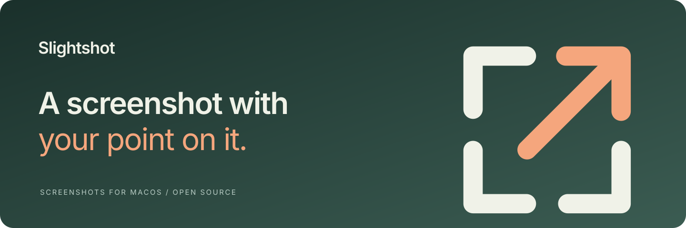
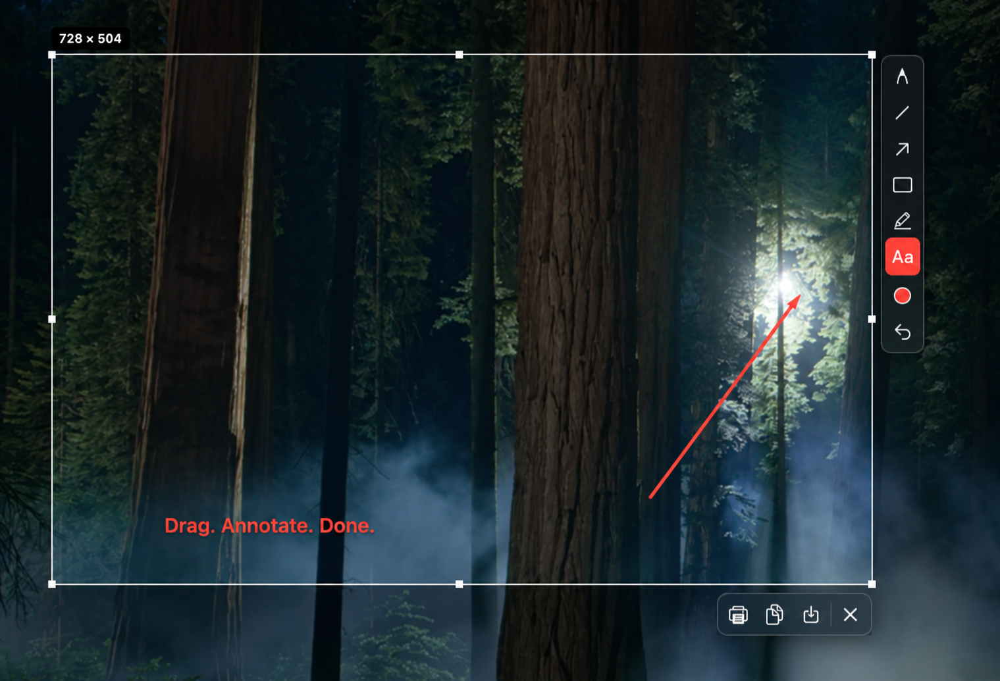

<p align="center">
  
</p>

<p align="center">
  A native screenshot app for macOS, inspired by Lightshot.<br>
  Select an area, add a note or an arrow, and copy it into your conversation.
</p>

<p align="center">
  <a href="#get-started">Get started</a> ·
  <a href="#screenshot">Screenshot</a> ·
  <a href="#shortcuts">Shortcuts</a> ·
  <a href="CONTRIBUTING.md">Contribute</a>
</p>

<p align="center">macOS 27+ · Apple silicon · MIT license</p>

## Capture an area

Slightshot lives in the menu bar. Press <kbd>⌘⇧9</kbd> and drag to select part of
your screen. The drawing tools appear beside the selection; copy, save and
print sit underneath it.

Use the pen, line, arrow, rectangle, marker or text tool to point something out.
You can change the colour and thickness, undo an annotation, or resize the
selection before copying it.

## Screenshot

<p align="center">
  
</p>

The image above is a reframed illustration of the capture overlay, edited from
a screenshot. It contains no menu bar or personal widgets.

A pixel magnifier helps you place the selection. Its size stays visible as you
drag. Hold <kbd>⇧</kbd> for a square selection or a constrained line, or hold
<kbd>⌘</kbd> while dragging to copy the area as soon as you release the mouse.
Each display has its own capture overlay.

## Get started

Download a `.dmg` from [Releases](https://github.com/jmpijll/slightshot/releases),
move Slightshot to Applications, then open it. Version 1.0.2 is signed with
Developer ID and notarised by Apple.

You can also install it with Homebrew:

```bash
brew tap jmpijll/slightshot https://github.com/jmpijll/slightshot
brew install --cask slightshot
```

On first launch, allow Screen Recording in **System Settings › Privacy &
Security › Screen & System Audio Recording**, then relaunch Slightshot.

## Shortcuts

You can change the three capture shortcuts in Settings.

| Shortcut | Action |
| --- | --- |
| <kbd>⌘⇧9</kbd> | Capture an area |
| <kbd>⌘⇧8</kbd> | Save the whole screen |
| <kbd>⌘⇧7</kbd> | Copy the whole screen |

While selecting or annotating:

| Shortcut | Action |
| --- | --- |
| <kbd>⌘A</kbd> | Select the whole screen |
| <kbd>⌘C</kbd> | Copy to clipboard |
| <kbd>⌘S</kbd> | Save to file |
| <kbd>⌘⇧S</kbd> | Save as |
| <kbd>⌘P</kbd> | Print |
| <kbd>⌘Z</kbd> | Undo the last annotation |
| <kbd>↩</kbd> | Confirm, copying by default |
| <kbd>Esc</kbd> or <kbd>⌘X</kbd> | Cancel |
| Arrow keys | Move the selection by one point |
| <kbd>⇧</kbd> + arrow keys | Move the selection by ten points |

## Privacy

Slightshot saves screenshots to your Mac or copies them to your clipboard.
It has no screenshot upload service, account system or application telemetry.
The app uses Sparkle to check for updates. You can also check manually in
Settings.

## Scripting

Start a capture from Shortcuts, Alfred, Raycast or a terminal:

```bash
open -a Slightshot --args --capture-area
open -a Slightshot --args --capture-full
open -a Slightshot --args --copy-full
```

## Build from source

You need macOS 27 and the Xcode 27 command line tools.

```bash
git clone https://github.com/jmpijll/slightshot.git
cd slightshot
make run
```

`make run` builds `build/Slightshot.app`, signs it with an available Developer ID
or an ad-hoc signature, and launches it. The project uses Swift Package Manager;
open `Package.swift` to work in Xcode.

| Command | Result |
| --- | --- |
| `make build` | Debug build |
| `make app` | App bundle, signed locally |
| `make dmg` | Disk image |
| `make release` | App and disk image, with notarisation and stapling |
| `make icon` | Regenerate app, menu bar and README artwork |
| `make lint` | Run SwiftLint, if installed |

To write debug logs to the terminal:

```bash
SLIGHTSHOT_DEBUG=1 ./build/Slightshot.app/Contents/MacOS/Slightshot
```

ScreenCaptureKit captures each display. AppKit overlays handle selection and
annotation. The editor and exporter share the same annotation drawing code.

See [CONTRIBUTING.md](CONTRIBUTING.md) for the code layout and contribution
checks, and [the release guide](docs/RELEASING.md) for signing and notarisation.

## Planned

- Blur and pixelation for redaction
- Numbered steps
- Selections across multiple displays
- Capture history
- Optional upload providers

## License

[MIT](LICENSE). Slightshot is an independent project inspired by Lightshot.
It shares no code with Lightshot and is not affiliated with Skillbrains.
