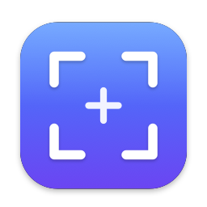

<div align="center">



# Slightshot

**A fast, native, open-source screenshot tool for macOS — built to feel exactly like Lightshot.**

[](https://github.com/jmpijll/slightshot/actions/workflows/ci.yml)
[](LICENSE)
[](https://www.apple.com/macos/)

</div>

---

## Why this exists

[Lightshot](https://app.prntscr.com/) is the screenshot tool a lot of people
reach for: hit one shortcut, drag a box, annotate it, copy it, done. The macOS
build is an unmaintained Intel binary, so it is on borrowed time.

Slightshot rebuilds that exact workflow as a small, native, Apple-silicon app.
Same muscle memory, none of the baggage:

- **Native capture** through ScreenCaptureKit — no screen-scraping hacks
- **Menu-bar only**, no Dock icon, launches in milliseconds
- **No account, no telemetry, no cloud** — your screenshots stay on your Mac
- **MIT licensed**, signed and notarised with a Developer ID

> Slightshot is an independent project inspired by Lightshot's interaction
> design. It is not affiliated with, endorsed by, or derived from Skillbrains'
> Lightshot, and shares no code with it.

## What it does

Press <kbd>⌘</kbd><kbd>⇧</kbd><kbd>9</kbd>. The screen freezes and dims, a pixel
loupe follows the crosshair, and you drag out the area you want.

Once you let go, two toolbars appear around the selection — tools on the right,
actions underneath — exactly where Lightshot puts them.

| Tools | Actions |
| --- | --- |
| Pen · Line · Arrow · Rectangle · Marker · Text | Print · Copy · Save · Close |
| Colour swatches and a thickness slider | |
| Undo | |

Plus the details that make it feel right:

- Pixel loupe with live coordinates and the hex colour under the cursor
- Live `1920 × 1080` size badge
- Eight resize handles, drag-to-move, arrow-key nudging
- <kbd>⇧</kbd> to constrain to a square or a 45° line
- <kbd>⌘</kbd>-drag to select and copy in one motion
- Every display gets its own overlay, at its own Retina scale

## Install

### Download

Grab the latest signed, notarised `.dmg` from
[Releases](https://github.com/jmpijll/slightshot/releases/latest), drag
Slightshot to Applications, and launch it.

### Homebrew

```bash
brew tap jmpijll/slightshot https://github.com/jmpijll/slightshot
brew install --cask slightshot
```

### First launch

macOS will ask for **Screen Recording** permission — every screenshot app needs
it. Approve it in *System Settings › Privacy & Security › Screen & System Audio
Recording*, then relaunch Slightshot.

## Shortcuts

### Global

| Shortcut | Action |
| --- | --- |
| <kbd>⌘</kbd><kbd>⇧</kbd><kbd>9</kbd> | Capture an area |
| <kbd>⌘</kbd><kbd>⇧</kbd><kbd>8</kbd> | Save the whole screen |
| <kbd>⌘</kbd><kbd>⇧</kbd><kbd>7</kbd> | Copy the whole screen |

All three are remappable in Settings.

### While capturing

| Shortcut | Action |
| --- | --- |
| <kbd>⌘</kbd><kbd>A</kbd> | Select the whole screen |
| <kbd>⌘</kbd><kbd>C</kbd> | Copy to clipboard |
| <kbd>⌘</kbd><kbd>S</kbd> | Save to file |
| <kbd>⇧</kbd><kbd>⌘</kbd><kbd>S</kbd> | Save as… |
| <kbd>⌘</kbd><kbd>P</kbd> | Print |
| <kbd>⌘</kbd><kbd>Z</kbd> | Undo the last annotation |
| <kbd>↩</kbd> | Confirm (copy by default) |
| <kbd>⎋</kbd> / <kbd>⌘</kbd><kbd>X</kbd> | Cancel |
| <kbd>↑</kbd><kbd>↓</kbd><kbd>←</kbd><kbd>→</kbd> | Nudge the selection |

These mirror Lightshot's own Mac shortcuts, so existing muscle memory carries
over unchanged.

## Building from source

Requires macOS 27 and the Xcode 27 command line tools.

```bash
git clone https://github.com/jmpijll/slightshot.git
cd slightshot
make run
```

`make run` builds a release binary, assembles `build/Slightshot.app`, signs it
with whatever Developer ID it finds (falling back to ad-hoc), and launches it.

| Target | What it does |
| --- | --- |
| `make build` | Plain debug build |
| `make app` | Build and sign `Slightshot.app` |
| `make dmg` | Build the disk image |
| `make release` | App, disk image, notarise and staple |
| `make icon` | Regenerate the icon from `Scripts/make_icon.swift` |
| `make lint` | SwiftLint |

Release and notarisation details live in [docs/RELEASING.md](docs/RELEASING.md).

## How it works

```
Hotkey (Carbon RegisterEventHotKey — no Accessibility permission needed)
   └─> ScreenCapture          freezes every display via ScreenCaptureKit
        └─> OverlayCoordinator  one shielding-level window per display
             └─> OverlayView     selection, tools, keyboard, toolbars
                  ├─ ScreenshotView   frozen pixels, GPU-composited, never redrawn
                  ├─ DimView          even-odd CAShapeLayer punches out the selection
                  ├─ CanvasView       annotations, handles, size badge
                  └─ MagnifierView    nearest-neighbour pixel loupe
                       └─> Renderer     flattens selection + annotations
                            └─> OutputService  clipboard · disk · printer
```

Two design decisions do most of the performance work:

**The screenshot is never redrawn.** It goes into a `CALayer`'s `contents` once
and stays on the GPU. Dragging a selection across a 6K display only swaps a
`CAShapeLayer` path.

**Annotations have one drawing path.** `Annotation.draw()` renders into whatever
graphics context is current, in flipped display points. The live canvas and the
exporter both call it, so what you see is exactly what gets written — there is
no second code path to drift.

## Not included (on purpose)

Lightshot's **Upload**, **Share** and **Search similar images** buttons all post
your screenshot to `prnt.sc`. Slightshot has no server and uploads nothing, so
those buttons do not exist. If you want them, opening an issue is the right
first step — a pluggable uploader is the obvious shape.

## Roadmap

- [ ] Pluggable upload providers (custom endpoint, S3-compatible, Imgur)
- [ ] Blur / pixelate tool for redaction
- [ ] Numbered step counters
- [ ] Selection that spans multiple displays
- [ ] Capture history

## Contributing

Issues and pull requests are welcome. `make lint` should pass, and please keep
the interaction model faithful to Lightshot — that fidelity is the whole point.

## License

[MIT](LICENSE). *Lightshot* is a trademark of Skillbrains; this project is not
affiliated with them.
