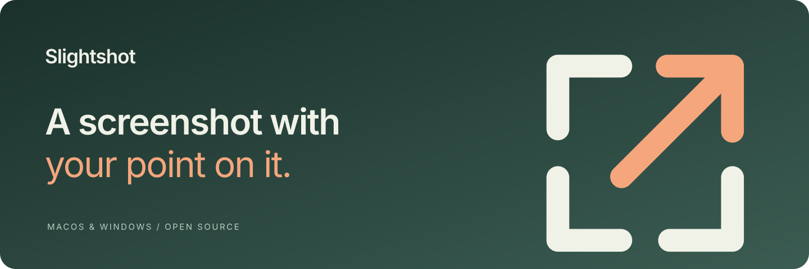
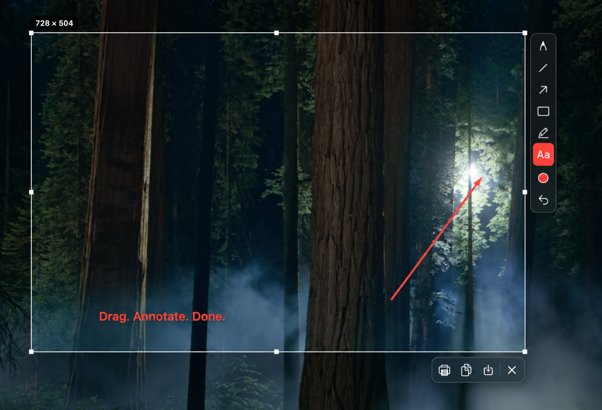

<p align="center">
  
</p>

<p align="center">
  A native screenshot app for macOS, inspired by Lightshot.<br>
  Select an area, add a note or an arrow, and copy it into your conversation.
</p>

<p align="center">
  <a href="#get-started">Get started</a> ·
  <a href="#screenshot">Screenshot</a> ·
  <a href="#shortcuts">Shortcuts</a> ·
  <a href="CONTRIBUTING.md">Contribute</a>
</p>

<p align="center">macOS 27+ · Apple silicon · MIT license</p>

## Capture an area

Slightshot lives in the menu bar. Press <kbd>⌘⇧9</kbd> and drag to select part of
your screen. The drawing tools appear beside the selection; copy, save, print
and record sit underneath it.

Use the pen, line, arrow, rectangle, marker or text tool to point something out.
You can change the colour and thickness, undo an annotation, or resize the
selection before copying it.

Choose **Blur** or **Pixelate**, then drag a rectangle over details you want
to obscure. The effect appears while dragging and is included when you copy,
save or print. Undo removes it just like any other annotation. Both tools work
locally on Mac and Windows; they do not modify live screen recordings.

Choose **Numbered steps** and click to place 1, 2, 3 in circles using the current
colour. Undo restores the next number, and each screenshot starts at 1. Circles
grow for extra digits and keep their size independent of the thickness slider.

Choose **Capture Area in 5 Seconds** in the Mac menu bar or Windows tray menu
to arrange a menu, tooltip or other transient content before the screen freezes.
The small countdown has a **Cancel** button and leaves keyboard focus with your
current app. At five seconds the area editor opens using fresh screen pixels.
Choosing the delayed action again restarts the countdown; an ordinary capture
cancels it and captures immediately. An existing editor or recording blocks
another capture. There is no additional setting or shortcut.

See the [native delayed-capture review evidence](docs/review/delayed-capture/README.md).

## Record an area

Select an area and click the **Record** button underneath it. The frozen
selection disappears and Slightshot records that part of the live screen.
A compact timer and **Stop** button stay beside the selected area.

After stopping, choose where to save the MP4 and adjust its quality slider:
**Small & fast**, **Balanced**, or **High quality**. The choice is remembered.
Small exports use a lower resolution, frame rate and bitrate; high quality
keeps more detail. Recording controls and other Slightshot windows are excluded
from the video. Recordings contain video only; microphone and system audio are
not captured, and screenshot annotations are not added to the live screen.

Cancel an export to choose another quality or destination. Cancel the save
panel to keep the recording or discard it. Temporary source files are removed
after saving, discarding, or quitting.

See the [live recording review video and validation](docs/review/recording/README.md)
for the native Record, Stop and save-time quality flow.

## Screenshot

<p align="center">
  
</p>

The image above is a reframed illustration of the capture overlay, edited from
a screenshot. It contains no menu bar or personal widgets.

A pixel magnifier helps you place the selection. Its size stays visible as you
drag. Hold <kbd>⇧</kbd> for a square selection or a constrained line, or hold
<kbd>⌘</kbd> while dragging to copy the area as soon as you release the mouse.
Each display has its own capture overlay.

## Get started

Download a `.dmg` from [Releases](https://github.com/jmpijll/slightshot/releases),
move Slightshot to Applications, then open it. Mac releases are signed with
Developer ID and notarised by Apple.

You can also install it with Homebrew:

```bash
brew tap jmpijll/slightshot https://github.com/jmpijll/slightshot
brew install --cask slightshot
```

On first launch, allow Screen Recording in **System Settings › Privacy &
Security › Screen & System Audio Recording**, then relaunch Slightshot.

## Shortcuts

You can change the three capture shortcuts in Settings.

| Shortcut | Action |
| --- | --- |
| <kbd>⌘⇧9</kbd> | Capture an area |
| <kbd>⌘⇧8</kbd> | Save the whole screen |
| <kbd>⌘⇧7</kbd> | Copy the whole screen |

While selecting or annotating:

| Shortcut | Action |
| --- | --- |
| <kbd>⌘A</kbd> | Select the whole screen |
| <kbd>⌘C</kbd> | Copy to clipboard |
| <kbd>⌘S</kbd> | Save to file |
| <kbd>⌘⇧S</kbd> | Save as |
| <kbd>⌘P</kbd> | Print |
| <kbd>⌘Z</kbd> | Undo the last annotation |
| <kbd>↩</kbd> | Confirm, copying by default |
| <kbd>Esc</kbd> or <kbd>⌘X</kbd> | Cancel |
| Arrow keys | Move the selection by one point |
| <kbd>⇧</kbd> + arrow keys | Move the selection by ten points |

## Privacy

Slightshot saves screenshots to your Mac or copies them to your clipboard.
It has no screenshot upload service, account system or application telemetry.
On macOS, the app uses Sparkle to check for updates. You can also check manually
in Settings. Windows preview updates are downloaded from Releases.

## Scripting

Start a capture from Shortcuts (Open URLs), Alfred, Raycast or a terminal.
These URLs work whether Slightshot is already running or starts with the command:

```bash
open 'slightshot://capture-area'
open 'slightshot://capture-full'
open 'slightshot://copy-full'
```

Only these exact URLs are accepted; paths, query parameters and fragments are
rejected. Commands received while a screenshot or recording session is busy are
ignored, keeping that session intact.

If several Slightshot bundles are installed, macOS chooses a registered bundle
for the URL. Updated copies forward the action to the one active Slightshot
process, without adding another menu item or registering competing hotkeys.
You can select a specific installed bundle with
`open -a '/Applications/Slightshot.app' 'slightshot://capture-area'`.
Quit an older version before switching to an updated copy; versions without the
URL route and ownership protocol cannot forward commands.

The existing `--capture-area`, `--capture-full` and `--copy-full` arguments
continue to work when starting a process, including a duplicate process which
forwards to the active owner. macOS does not deliver new arguments to an already
running process, so use the URLs for commands that must also work on warm starts.

## Build from source

You need macOS 27 and the Xcode 27 command line tools.

```bash
git clone https://github.com/jmpijll/slightshot.git
cd slightshot
make run
```

`make run` builds `build/Slightshot.app`, signs it with an available Developer ID
or an ad-hoc signature, and launches it. The project uses Swift Package Manager;
open `Package.swift` to work in Xcode.

| Command | Result |
| --- | --- |
| `make build` | Debug build |
| `make app` | App bundle, signed locally |
| `make dmg` | Disk image |
| `make release` | App and disk image, with notarisation and stapling |
| `make icon` | Regenerate app, menu bar and README artwork |
| `make lint` | Run SwiftLint, if installed |
| `make test` | Verify raster effects, annotation export and recording |

To write debug logs to the terminal:

```bash
SLIGHTSHOT_DEBUG=1 ./build/Slightshot.app/Contents/MacOS/Slightshot
```

ScreenCaptureKit captures each display. AppKit overlays handle selection and
annotation. The editor and exporter share the same annotation drawing code.

See [CONTRIBUTING.md](CONTRIBUTING.md) for the code layout and contribution
checks, and [the release guide](docs/RELEASING.md) for signing and notarisation.

## Further development

The [focused follow-up after 1.2.0](docs/NEXT_STEPS.md) is complete in 1.3.0:
numbered steps, save retry, Mac capture commands, Windows version/update polish
and measured performance fixes. Further work should focus on demonstrated
reliability or performance problems. Capture history, upload providers and
selections across displays need clear user demand before adding more scope.

## Windows preview

Download the portable [x64 ZIP](https://github.com/jmpijll/slightshot/releases/latest/download/Slightshot-windows-x64.zip)
or [ARM64 ZIP](https://github.com/jmpijll/slightshot/releases/latest/download/Slightshot-windows-arm64.zip),
extract it, then run the single `Slightshot.exe` inside. The runtime is included.
These Windows preview builds are unsigned and follow the Mac capture, recording and overlay
style with shared original toolbar icons.

See [Windows setup and parity notes](docs/windows.md) for shortcuts, building
and the native CI evidence. The maintainer verified the capture and recording
workflow on a Windows desktop on 8 October 2026; ARM64 is cross-built and inspected.

## License

[MIT](LICENSE). Slightshot is an independent project inspired by Lightshot.
It shares no code with Lightshot and is not affiliated with Skillbrains.
