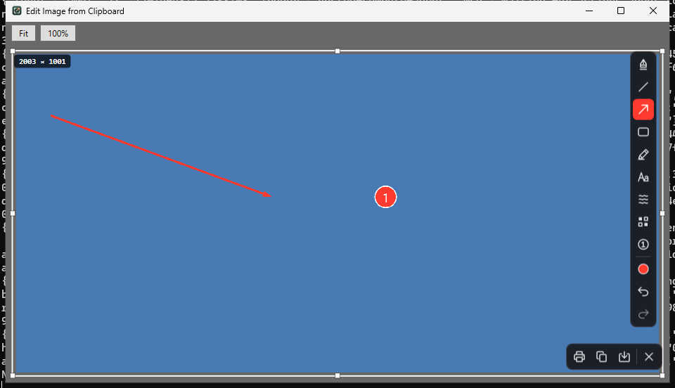
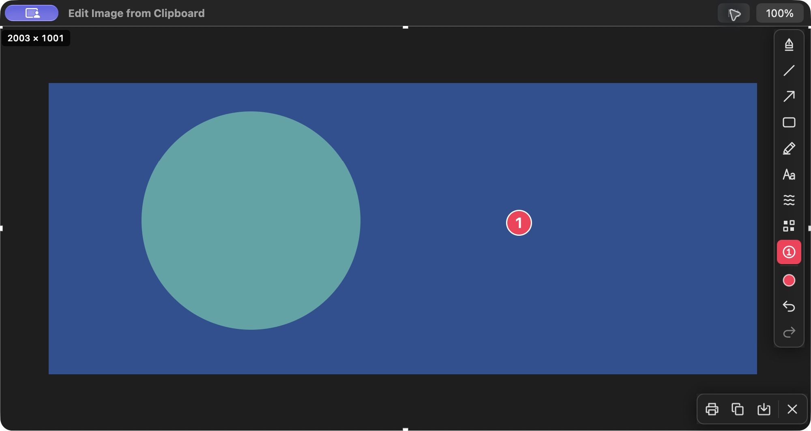
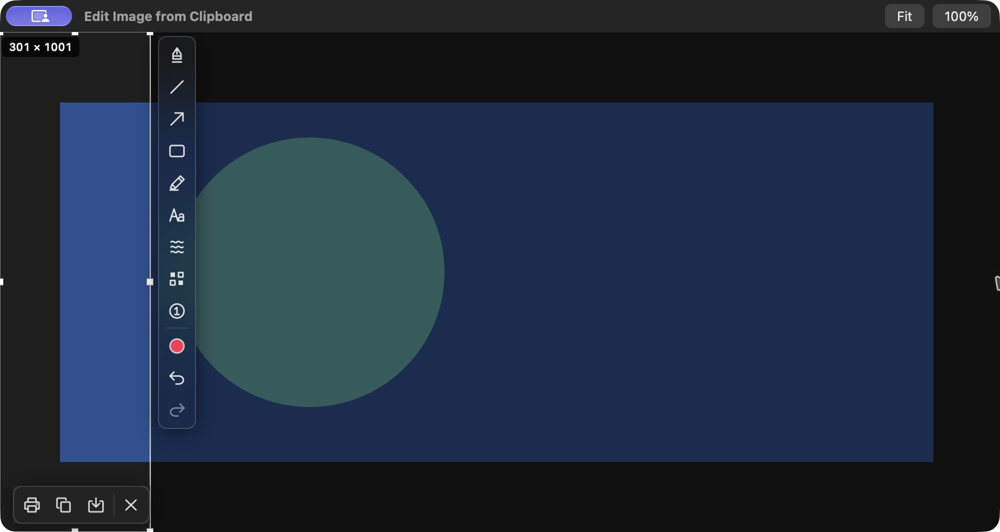

# Clipboard image editor review

The menu-bar/tray **Edit Image from Clipboard** action reads the clipboard only
when requested. It opens the existing crop/annotation editor in a normal native
window, with Fit and 100% viewing. Native PNG/TIFF decoding preserves source pixels
and alpha. Bitmap fallback is supported on Windows. File URLs/drops are ignored.
Screen capture, imported-image editing and modal output share one session gate.
Recording is unavailable for imports. Cancelled/failed output retains the editor;
success, Escape and native close release ownership.

## Repeatable checks

- `swift build`, `swift test`, `swiftlint --strict --quiet`
- `dotnet run --project Windows/Slightshot.Core.Tests -c Release`
- `dotnet build Windows/Slightshot -c Release`
- On Windows: `Slightshot.exe --clipboard-smoke-test <evidence-directory>`

The native Windows smoke test runs the real tray action route with a synthetic
2003 × 1001 transparent clipboard PNG at 192 DPI and annotation fixture. It saves
a desktop screenshot of the actual WPF window, the source image, a real PNG export
and `clipboard-validation.json`. It checks empty/text/file-drop rejection, PNG
priority over Bitmap, Fit/100%, alpha, full pixel resolution with the screenshot
resolution setting disabled, output cancellation/write failure/retry, busy input
rejection and native close. A fractional source-pixel crop checks annotation/raster
positions, preview/export parity and single alpha composition. Combined native
checks cover imported Undo/Redo, busy countdown rejection and cancellation of a
pending countdown/HUD by the clipboard action. CI publishes `windows-native-clipboard-evidence`.
The source/annotation fixture is synthetic; the WPF window and output pipeline are real.

## macOS manual acceptance

Build `VERSION=0.0.0-review BUILD=1 ./Scripts/bundle.sh` and launch
`open -n build/Slightshot.app --args --clipboard-review <evidence-directory>`.
This bounded fixture seeds a 2003 × 1001 PNG with transparent margins and
semitransparent artwork, opens the real clipboard editor and creates the real menu
bar action. It requests no screen capture permission, registers no hotkeys and
exits after a successful output or five minutes. It holds original clipboard data only in memory and
restores the seed or its own Copy exports on normal termination. A clipboard
changed externally is preserved. It writes source/export PNG and JSON under the
provided directory (default `build/clipboard-review`) for pixel/alpha inspection
without including private clipboard contents in evidence. The timer menu uses the
production controller/HUD with synthetic clipboard input at its deadline; it permits
busy-rejection and pending-countdown cancellation checks without screen capture.

Check annotation and crop tools, Fit/100% and scrolling, menu-triggered busy
rejection, cancelled Save As followed by retry, native close followed by another
menu import, and PNG Copy/Save pixel dimensions and transparency. Capture the
native window and exported image for the PR. The fixture artwork is synthetic;
manual interaction with the actual AppKit editor supplies macOS acceptance evidence.

## Captured Windows evidence

Native WPF smoke and all Windows build/parity/recording/package checks passed in
[run 37780758497](https://github.com/jmpijll/slightshot/actions/runs/37780758497)
at final product source `84688139d99153575decb985564f3c7db3b5482c`.
Mac and portable CI also passed at this source in
[run37780758480](https://github.com/jmpijll/slightshot/actions/runs/37780758480).

- [Native edited PNG export](windows/clipboard-edited-export.png), 2003 × 1001 pixels with alpha
- [Synthetic original clipboard PNG](windows/clipboard-source.png)
- [Native validation checks](windows/clipboard-validation.json)
- [Fractional native crop](windows/fractional-export.png), [full-render crop reference](windows/fractional-golden.png) and [zero-difference report](windows/fractional-differences.json)
- [Run, source, fixture and SHA-256 provenance](windows/provenance.json)

The screenshot is a desktop capture of the actual application window. The source
and annotation contents are repeatable synthetic fixtures. They do not claim a
human Windows acceptance session.

## Captured macOS evidence

Native AppKit desktop acceptance used the signed review bundle at source commit
`2863e09b43f7cee9ed4f93b24eecb9fd4872ee66`. The final fractional crop-label
follow-up was checked again at `84688139d99153575decb985564f3c7db3b5482c`.
The original PNG is a synthetic review fixture; native mouse and keyboard interaction created the numbered step and exercised the editor.

- [Fit view](mac/clipboard-fit.jpg) and [100% view with native scrolling](mac/clipboard-100percent.jpg)
- [Original fixture PNG](mac/clipboard-review-source.png) and [actual Copy export PNG](mac/clipboard-review-export.png)
- [All-pixel alpha validation](mac/mac-output-validation.json) and [export pixel/alpha report](mac/clipboard-review-export.json)
- [Source, checks and SHA-256 provenance](mac/provenance.json)

The source/export comparison checked all 2,005,003 pixels: transparent margins
remained unchanged, and alpha changed only at the committed numbered step.
Fit/100% and native scrolling, a real annotation click, Undo/Redo, Save As panel
cancellation with retained edits, and toolbar Copy passed. Successful output wrote
an original-resolution PNG and gracefully terminated the fixture, restoring its
owned clipboard. The fixture stores any previous private clipboard data only in
memory and preserves external changes; those contents are absent from this record.

At the final source, a real selection-handle drag covered 300.45 source pixels.
The badge correctly displayed **301 × 1001**, matching the
[actual cropped Copy PNG](mac/clipboard-review-crop.png) and its
[pixel/alpha report](mac/clipboard-review-crop.json). See the
[final crop provenance](mac/crop-provenance.json). The review fixture gracefully
quit after output; the original synthetic PNG is shared with the earlier check.
