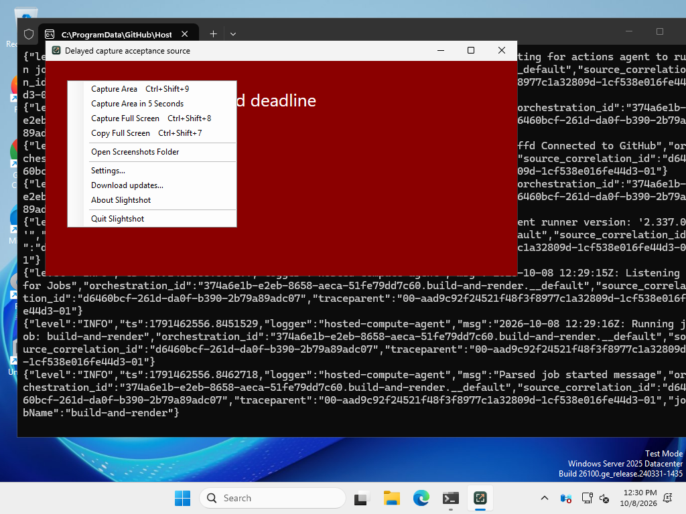
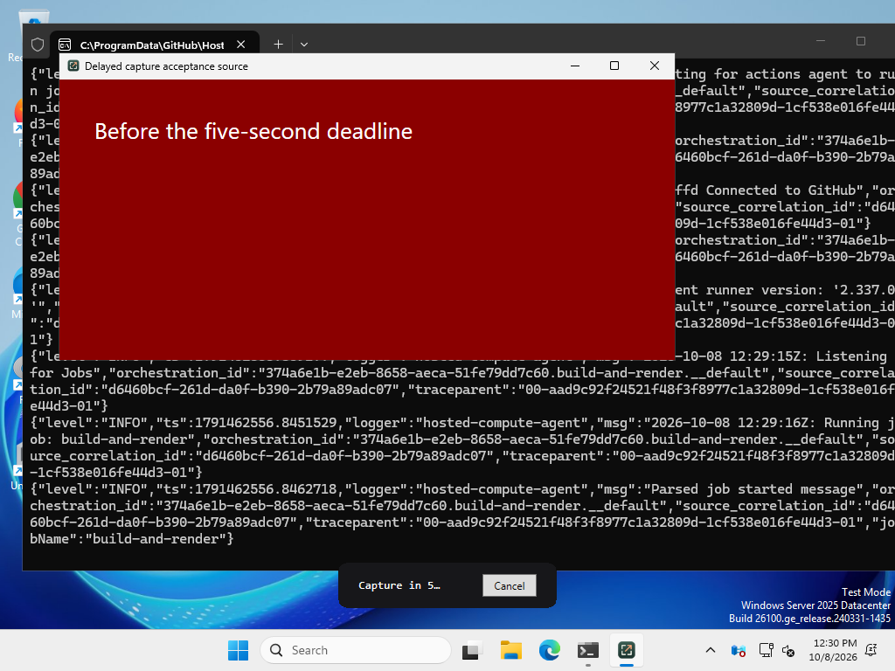
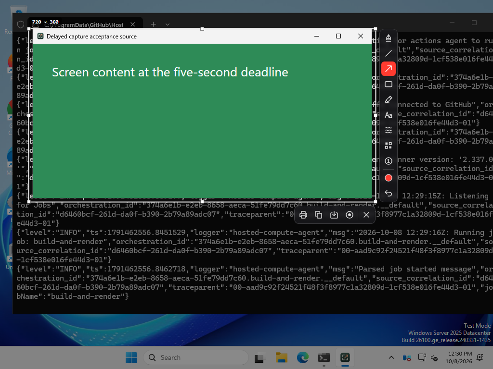
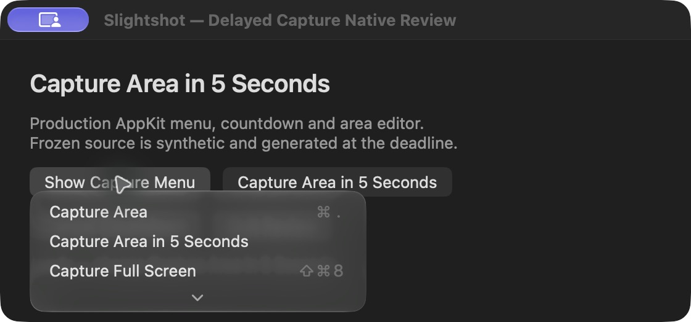
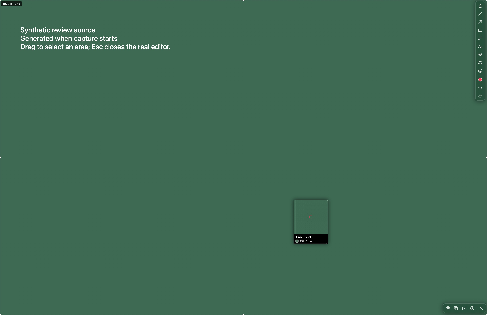

# Delayed capture review evidence

The Mac menu bar and Windows tray have **Capture Area in 5 Seconds**. The
fixed countdown leaves the target application's keyboard focus alone and has
an explicit **Cancel** button. At the deadline the normal area editor opens
with freshly captured pixels. Repeating the action restarts one countdown;
ordinary captures cancel it and capture immediately. Existing editors and
recordings reject another request. Quit invalidates the timer and stale queued
callbacks cannot open another editor.

## Windows native acceptance

The Windows CI `--delayed-capture-smoke-test` uses the production tray menu,
countdown controller, native WPF windows, GDI desktop capture and area editor.
The target is a real WPF acceptance window whose content changes from red to
green *after* scheduling. The smoke asserts that the frozen source contains the
later green pixels, that no editor appears before five seconds, that the
nonactivating countdown preserves target focus, that a busy editor rejects a
new timer, and that Cancel and ordinary capture prevent a late second editor.
The countdown is closed and the tray menu is dismissed before desktop
composition is flushed for capture.

These unchanged desktop screenshots came from successful native
[Windows CI run 37777192797](https://github.com/jmpijll/slightshot/actions/runs/37777192797),
feature source `8ea19cf6927974f7bb830f177a224965d3e1a22a` and CI merge checkout
`43230082b39bd57b406f7b37e2bbdee29901c881`. The complete
[validation report](delayed-capture-validation.json) is saved alongside them.
Its elapsed time covers the whole fixture, including waits after cancellation
and ordinary capture; the editor deadline is separately checked at five seconds.
The CI desktop and runner terminal are visible behind the real acceptance
window; these are native application screenshots, with no visual mockups.

| Production tray menu | Passive countdown with Cancel |
| --- | --- |
|  |  |

The actual area editor retains the green content changed after scheduling:

## Mac desktop acceptance

The production menu and full-selection editor were captured on macOS from
`d52d5e14384610f4fe1c642c76f07972a01989ce`, after integrating the Redo parent.
The countdown HUD and Start/Cancel/focus checks came from
`8ea19cf6927974f7bb830f177a224965d3e1a22a`. The
[Mac validation record](mac-validation.json) identifies the observed checks;
[the HUD source report](mac-hud-source.json) confirms a ScreenCaptureKit
screenshot of the live production panel window.

The native application was driven through CUA in the bounded review fixture.
Its frozen screen source is explicitly synthetic and is created when the
countdown callback fires. The menu, countdown panel, real selection overlay and
editing toolbars are actual AppKit UI, with no generated visual mockups. This
Mac fixture does not claim a live screenshot of another application's transient
content; Windows CI above checks that live pixels changed after scheduling.

| Production menu | Actual countdown window |
| --- | --- |
|  |  |

After the deadline, Command-A selected the synthetic source in the actual area
editor. The editing tools and output actions are visible:

The countdown uses a nonactivating AppKit panel. It closes before capture;
ScreenCaptureKit also excludes Slightshot's own windows. The timer uses a
monotonic five-second deadline and runs while a popup menu is open.

For an isolated native UI review alongside an existing Slightshot owner, launch
the freshly built bundle with `--delayed-review`. This bounded five-minute
fixture bypasses the command inbox, global shortcuts and updater. Its small
review window exposes the actual production menu and the same countdown
controller/panel. The callback presents the actual area editor with an explicitly
labelled synthetic source created when capture starts. This demonstrates native
menu/countdown/editor behavior without capturing private desktop content; it
does not claim a live ScreenCaptureKit snapshot. Windows CI above separately
checks actual live pixels changed after scheduling.

Add `--delayed-review-evidence /absolute/output/directory` to save the actual
countdown HUD after starting through the review UI. The helper captures only
the app's own panel window with ScreenCaptureKit; if unavailable, it renders the
actual native AppKit content view. `mac-hud-source.json` identifies the method
used, and `mac-hud.png` contains the result. It never takes a full-desktop image.

Run the freshly built app bundle, then:

1. Open the Slightshot menu and verify **Capture Area in 5 Seconds** appears
   once, with no additional shortcut or preference.
2. Choose it. Confirm the small countdown and **Cancel** action appear and the
   target app retains keyboard focus. Open a target-app menu or tooltip before
   the deadline; confirm it appears in the frozen area editor afterward.
3. Cancel the editor, start the countdown again, click **Cancel**, and wait
   beyond five seconds. Confirm no editor opens.
4. Start the countdown, choose the delayed action again before it completes,
   and confirm the new five-second countdown produces only one editor.
5. Start a countdown and press the ordinary capture shortcut. Confirm immediate
   capture and no extra editor after five seconds. Repeat with full-screen copy.
6. Try the delayed action while an editor or recording is active; confirm the
   existing session stays in place. Quit during a countdown and confirm no
   callback survives termination.

The deterministic Swift and portable Windows tests exercise queued callbacks
after cancellation, replacement and termination, duplicate deadline delivery,
no capture before five seconds, and a busy owner at scheduling and deadline.
