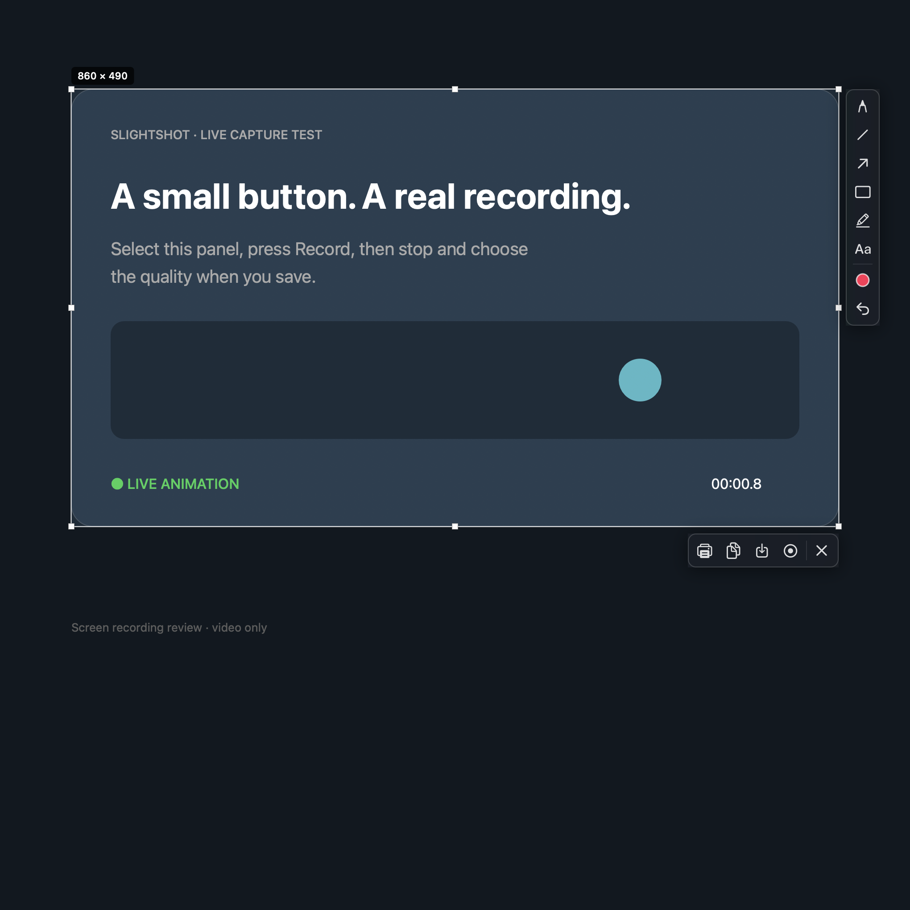
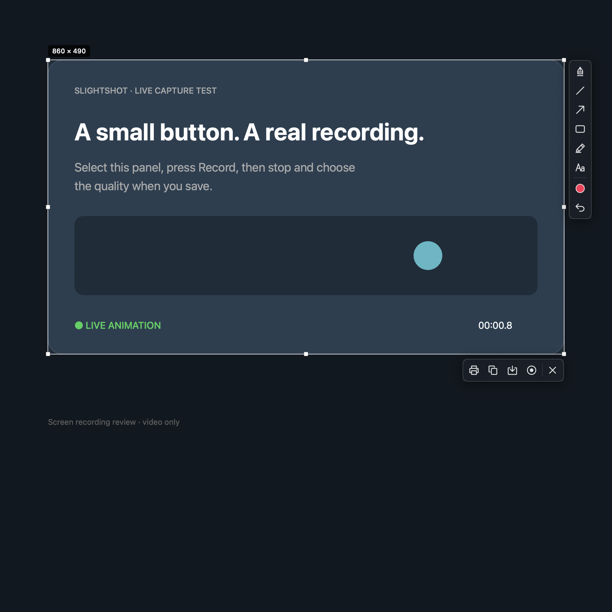
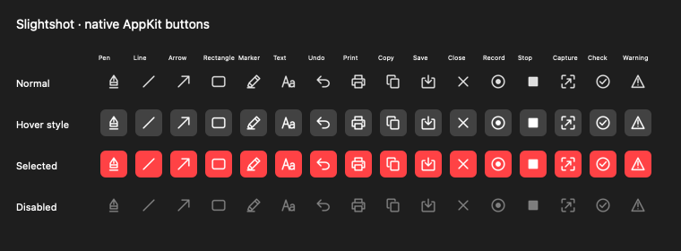
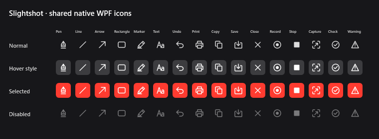
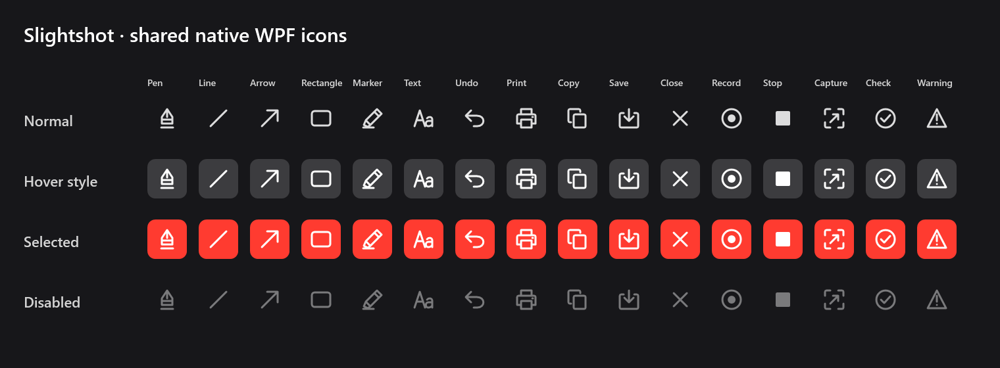

# Shared icon review

The original vectors are shared across CoreGraphics/AppKit and native WPF. The source SHA-256 is `04f6b157a6dee3a7c103dd0b5c8be6b4c87af836dd7871f951bceaf9e524df90` (UTF-8/LF normalised so Windows checkouts produce identical assets).

## Live Mac before / after

Both captures use the same clean test panel and an 860 × 490 logical-point selection at 2× display scale. The Mac button positions, toolbar blur, corner radii, tints and interactions are retained. The artwork changes visibly, particularly Pen, Print and Copy; these are original paths rather than exported Apple artwork.

| Before: system glyphs | After: original shared glyphs |
| --- | --- |
|  |  |

[Selected Pen](mac-selected.png) and [live recording / Stop](mac-recording.png) are real Mac screen captures. Only the clean fixture is included.

[23-second proof video](shared-icons-review.mp4): the first 18 seconds show the actual Mac toolbar, selecting Pen and starting Record with the live border and Stop button. The final five seconds play an excerpt from the MP4 exported by this build. That export decoded as H.264, 1720 × 980, 30 fps, duration 30.247 seconds. Stop and the High quality slider were exercised through the actual save panel. The save interaction is not in this trimmed video.

## Native state fixtures

Each board contains all 16 paths, including Record/Stop and status fallbacks, at 1× and 2×. AppKit boards render the production `ToolbarButton` offscreen with normal, hover-style, selected and disabled properties; hover is supplied directly to the fixture, without live mouse input. Windows boards render the production WPF button renderer with the same states. These boards are synthetic native fixtures, not manual Windows desktop interactions. Native font rendering, colour management and system accent treatment can differ; glyph geometry is shared exactly. The existing native fonts/materials remain as described in [the asset audit](../../asset-audit.md).

| Scale | Mac / AppKit | Windows / WPF |
| --- | --- | --- |
| 1× |  |  |
| 2× |  |  |

The native comparison found that WPF disabled artwork was darker than AppKit; its opacity now matches the observed Mac 50% treatment. AppKit's current visual styling is retained.

## Reproduce

```sh
python3 Scripts/generate_ui_icons.py --check
swift test
swiftc Sources/Slightshot/Overlay/ProductIcon.generated.swift Sources/Slightshot/Overlay/ProductIcon.swift Sources/Slightshot/Overlay/ToolbarPanel.swift Scripts/render_ui_icon_review.swift -o /tmp/slightshot-icon-review
/tmp/slightshot-icon-review build/icon-review
```

Windows CI runs `--smoke-test` and stores the boards and `validation.json` in `windows-native-parity-evidence`. Tests render every glyph at both scales, reject clipping/empty artwork, and verify Record dimensions, accessibility and click behavior. Strict lint, Swift debug/release builds, native Windows builds, portable geometry checks and recording/export regression checks pass. The live Mac test used the signed bundled app, not the Swift executable alone.
