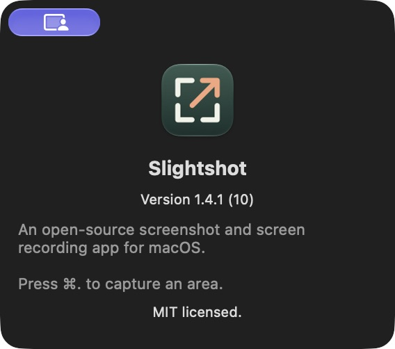
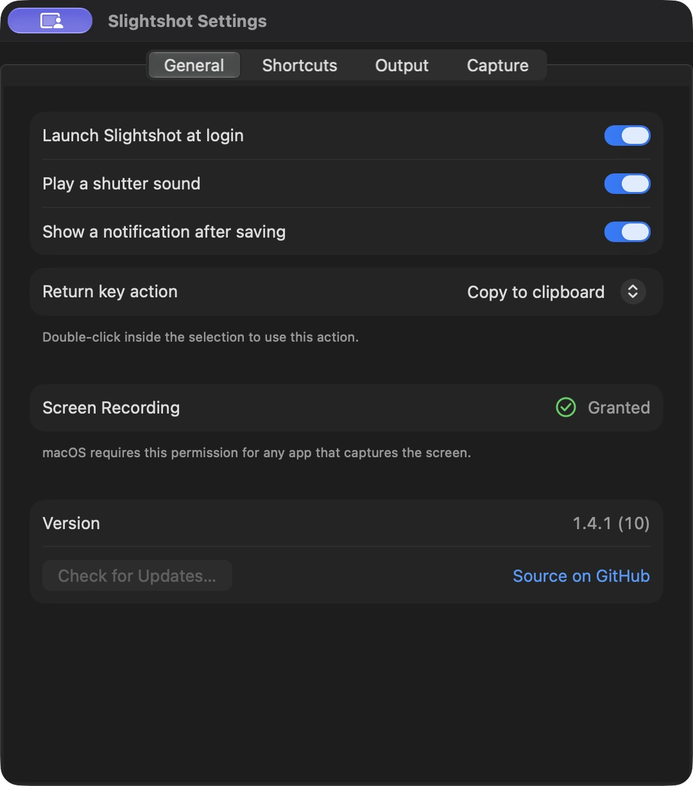
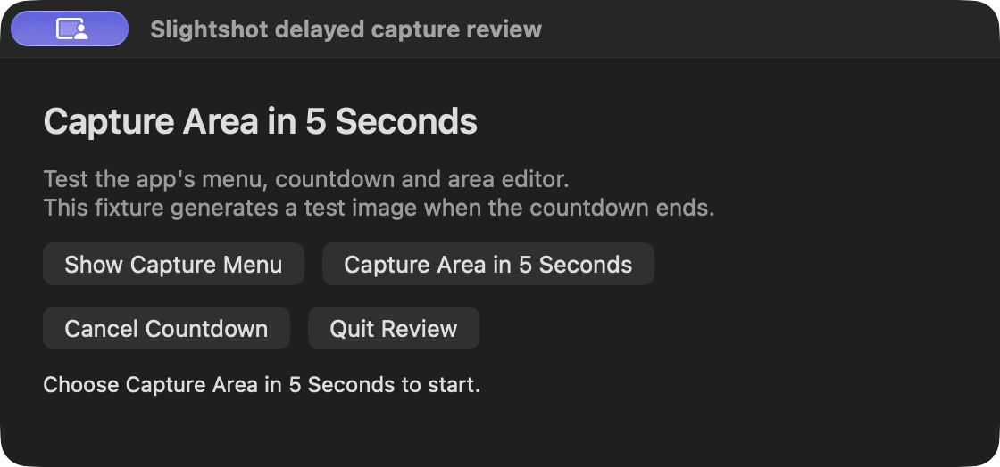
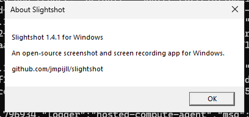
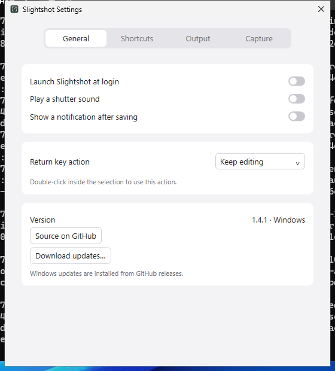
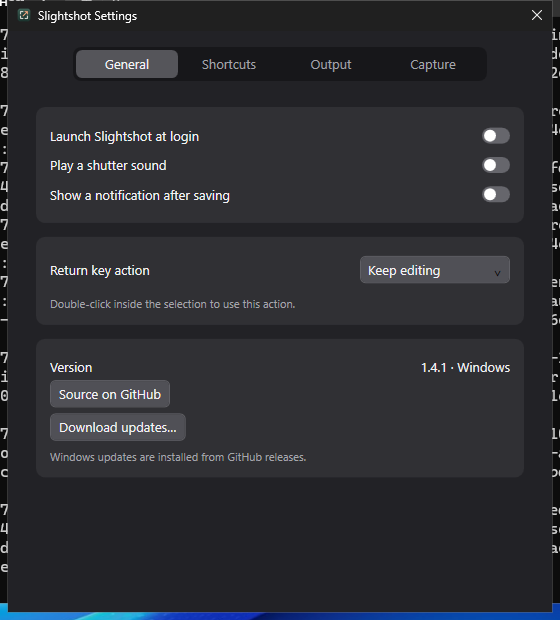
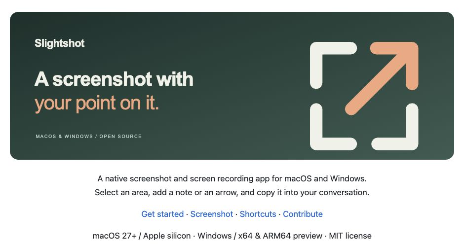
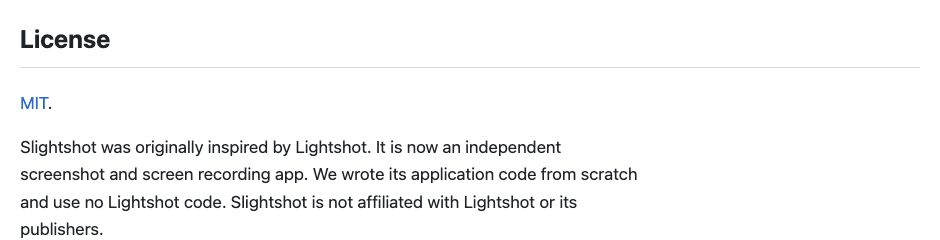
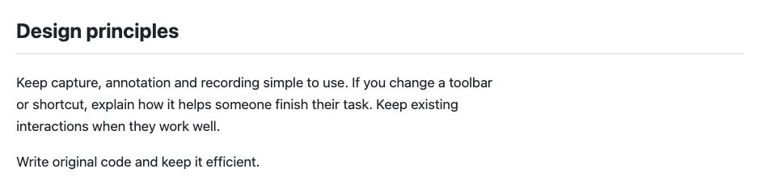

# Project text review

Captured on 8 October 2026. The macOS application and documentation use source
commit `89195620540adf9fe352af3ebb580a717758fff8`. The Windows application uses
`392b642200d6f2d69942ea50bbbc194ef8ea3c7f`. `validation.json` records source,
executable and screenshot hashes.

## macOS

These are real AppKit and SwiftUI windows on macOS 27, Apple silicon, version
1.4.1 (10). The existing `--delayed-review` launcher ran in an isolated, locally
signed app copy. Automated clicks opened the production About panel and General
settings. The native accessibility menu also verified the Keep editing option.
No capture was started and settings values were preserved.

## Windows

These are real WPF settings windows and the production Win32 About message on
Windows Server 2025. The automated native fixture sets the Return key action to
Keep editing and disables sound. It opens General settings in both themes, then
invokes the production tray About action and clicks the actual OK button.
Captures are desktop pixels cropped to each window. The
[Windows workflow](https://github.com/jmpijll/slightshot/actions/runs/37802763563)
passed; its native report is preserved in `windows-native-validation.json`.

## Documentation

The screenshots show the README and contribution guide rendered with GitHub's
Markdown API in a local browser.

## Checks

- Release app build, signature, Info.plist and runtime linkage checks passed.
- SwiftLint, Ruby and Bash syntax checks passed.
- Python script tests passed, 14 tests.
- Windows core checks passed, 191 checks; cross-build had no warnings or errors.
- Windows native app, portable package and installer lifecycle checks passed.
- Reference, em dash and whitespace checks passed.
