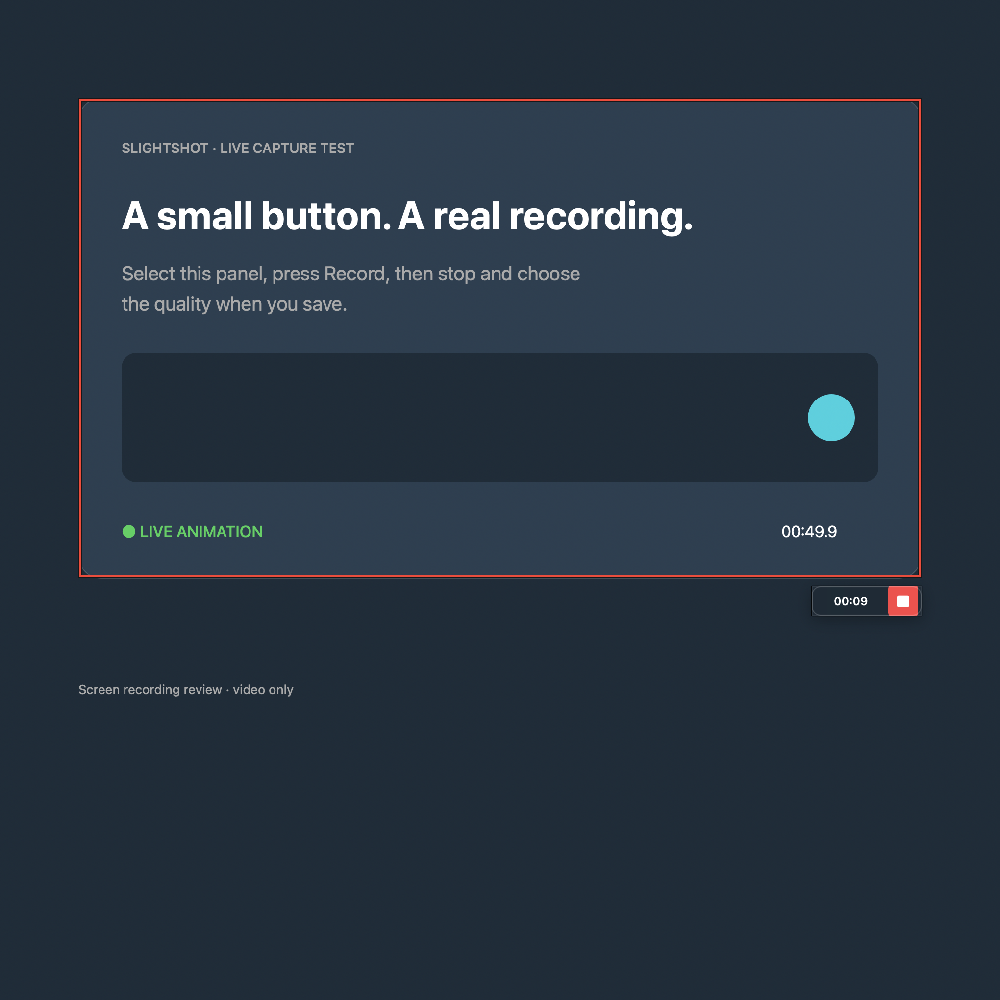
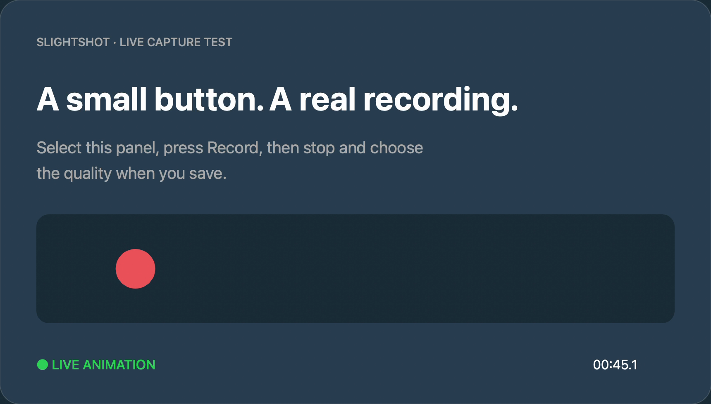

# Mac recording review evidence

## Persistent recording boundary

[Watch the new 40-second boundary review](recording-boundary-review.mp4) and [play its original saved MP4](recording-boundary-output.mp4).

Signed build 15 on macOS 27, code revision `cdf28a530fcedc6f14e933b9ae4eee9cfd52e92c`, keeps four red edges visible throughout live recording. A dark inner/outer hairline adds contrast. The frame follows the exact selected region, passes mouse input through, and closes with Stop, failure or capture cleanup. It is excluded with all other Slightshot windows.

The review contains real region selection/Record, the persistent live boundary, Stop, High quality and Save, followed by five seconds of playback from the original saved MP4. It is cropped to the clean animated test window. Idle intervals were removed: raw intervals 0–14, 21–31 and 45–56 seconds, then exported-file interval 3–8 seconds. No application UI was composited or simulated.

The export is H.264, 1720 × 980, 18.49 seconds, 3,429,571 bytes, without audio; its nominal frame rate is 30 fps (variable delivered cadence, average 25.68 fps). It fully decodes. Every decoded frame's four 8-pixel edge strips were checked for the visible red line, with **zero boundary pixels** found. The original test content has no red at those edges. [Exact metadata and checks](recording-boundary-validation.json) accompany the export.

[Mac CI for the boundary code](https://github.com/jmpijll/slightshot/actions/runs/37633685072) passed the production build, signed bundle, strict lint, seven release-gate checks and five Swift tests.

## Original recording-flow review

[Watch the 53-second review video](recording-review.mp4) and [play the original saved MP4](recorded-output-proof.mp4).

This is an actual screen recording from signed Slightshot build 14 on macOS 27, using code commit `5ce9b0f`. The source is a clean native test window with a moving coloured ball and timer. No personal desktop content is included.

The review video crops to that test window and removes idle intervals. Its last five seconds play the unmodified exported file. The selection was created with Select All and corner resizing through macOS accessibility; the Record, Stop, quality and Save controls are the real application UI.

| Review time | Evidence |
| --- | --- |
| 0–12 seconds | Region selection and Record action |
| 12–25 seconds | Live recording, Stop and high-quality save option |
| 25–30 seconds | Balanced save option |
| 30–35 seconds | Small & fast save option |
| 35–48 seconds | MP4 export and completion |
| 48–53 seconds | Playback of the saved region, without Slightshot controls |

The saved file is H.264, 1280 × 728 at 15 fps, 28.84 seconds and 1,292,748 bytes. It has no audio stream and fully decodes. See [validation.json](validation.json) for the exact output metadata and observed checks.

[Mac CI](https://github.com/jmpijll/slightshot/actions/runs/37625575548) verifies the production build, signed bundle, strict lint, seven release-gate tests and five Swift tests. Media tests compare encoded frames for all quality presets, output size, cancellation, atomic replacement and temporary cleanup; the fifth test covers native numeric slider accessibility.

Windows foundation and Windows recording have separate PRs and evidence. These Mac recordings do not claim interactive Windows desktop validation.
