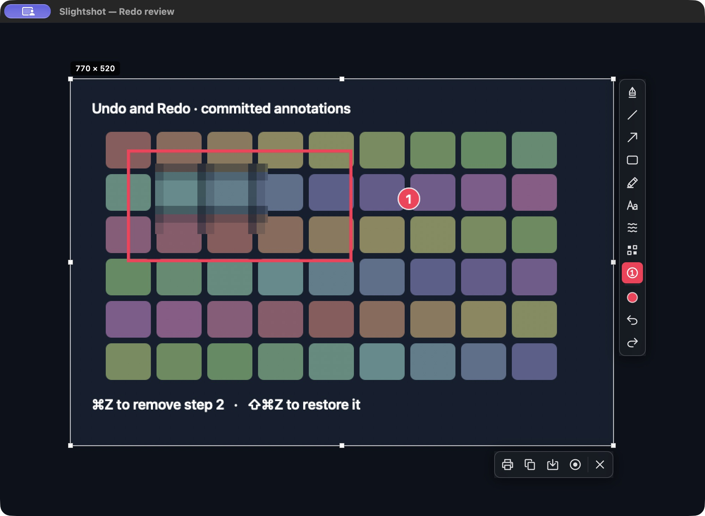
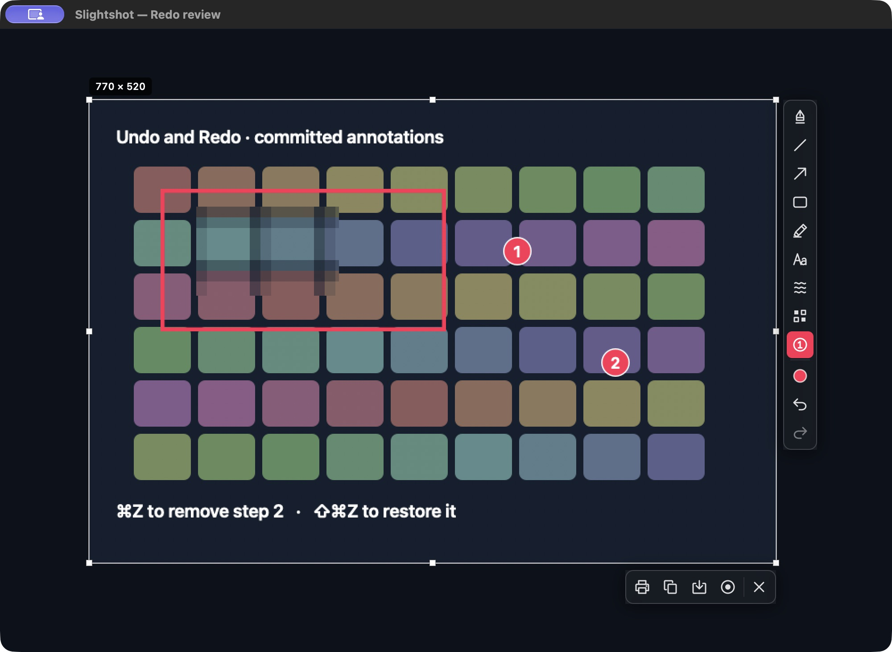
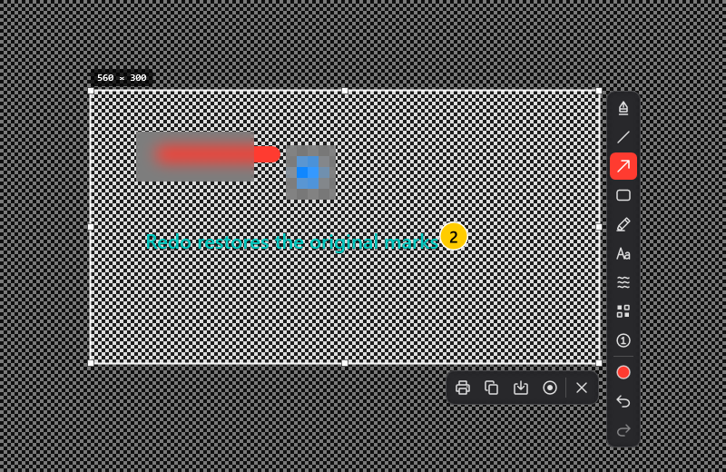
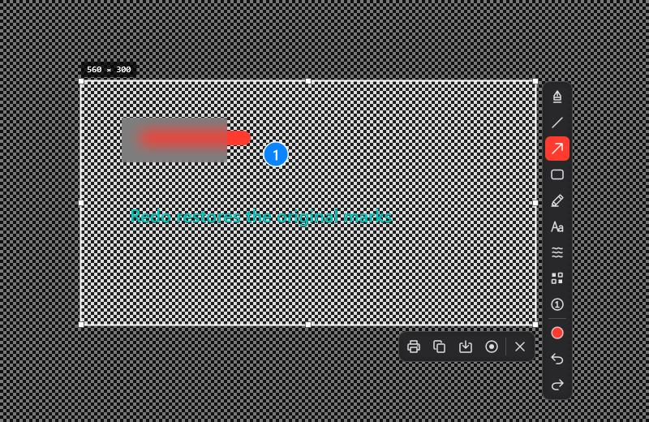

# Native annotation Redo review

Redo restores committed marks in their original order and style, including text,
blur, pixelation and numbered steps. New committed annotations and new selections
clear the redo branch. Draft text uses its native text undo manager.

## macOS desktop acceptance

These are actual native AppKit window screenshots captured through CUA on
8 October 2026. The final editor code at `59dc103` was built as a Developer-ID
signed app and launched with `--redo-review`. The bounded review window uses the
production `OverlayView`, toolbars and gesture paths over a synthetic 1000×700
source image; the screenshots are 2000×1464 Retina pixels including the titled
window frame. No personal screenshot was used.

The reviewer sent ⌘Z: step 2 disappeared and Redo became available. Sending
⌘⇧Z restored step 2 and disabled the exhausted Redo button. Undo followed by
clicking the toolbar Redo button also restored step 2. Escape closed the review
window. The rectangle, pixelation and step 1 stayed intact throughout.

Before Undo:


After ⌘Z:



After ⌘⇧Z:



Reproduce the bounded fixture after building an app bundle:

```sh
open -n build/Slightshot.app --args --redo-review
```

It closes after five minutes or Escape. This review path does not claim tray
ownership, register capture shortcuts or capture the desktop.

## Automated lifecycle checks

The Swift suite passed all 43 tests. Four new Redo lifecycle tests verify exact
restored export bytes for ordered blur/pixelation/vector/text/step annotations,
keyboard and toolbar Redo, repeated empty/exhausted operations, step numbering,
new edit and selection invalidation, retained cancelled drafts, tool/style changes
and native draft text undo/redo. Strict SwiftLint and the 20 shared icon assets pass.
The .NET core suite passes 170 checks, including ordered object restoration,
repeated cycles, step numbering and new edit/selection invalidation. Windows
cross-compilation passes with no warnings or errors.

## Windows native smoke acceptance

The [successful Windows run](https://github.com/jmpijll/slightshot/actions/runs/37775032123)
executes the production WPF editor and `--smoke-test` on Windows. The saved
images below are native WPF overlay/control renders over a synthetic source,
not a manual desktop capture. The full downloadable `windows-native-parity-evidence`
artifact includes before/undone/restored overlay and export PNGs at 100%, 125%,
150% and 200% DPI, also checked against the extracted portable x64 app.
The [native report](windows-validation.json) is preserved here.

The fixture removes the last step and pixelation effect with toolbar Undo and
the production Ctrl+Z handler, then restores the effect through toolbar Redo and
step 2 through the Ctrl+Y handler. It also replays all marks twice using
Ctrl+Shift+Z. Original text, vector, effect and step objects and exported pixels
are restored exactly; the preview interior matches export. Native WPF TextInput,
TextBox Undo/Redo and both redo handler gestures keep annotation history intact
while drafting. New committed text, full-display selection and a fresh selection
invalidate Redo. This evidence covers the native handler paths and rendering;
manual Windows desktop shortcut/focus acceptance was not performed for this feature.

Before Undo:



After Undo:



After Redo:


