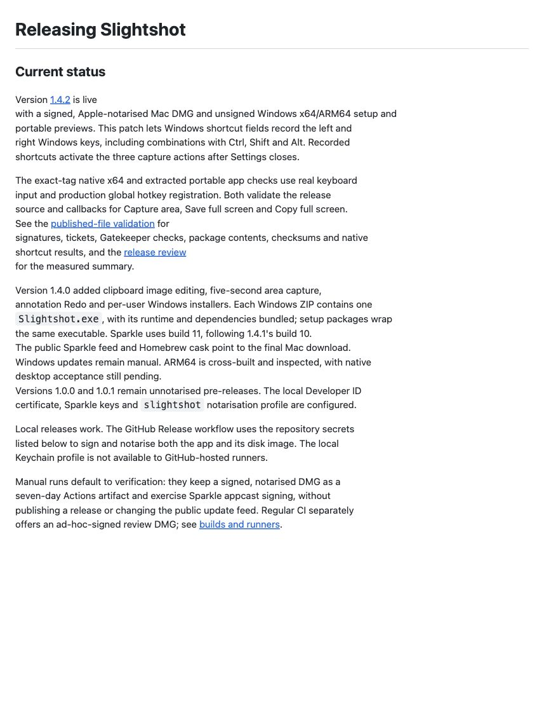
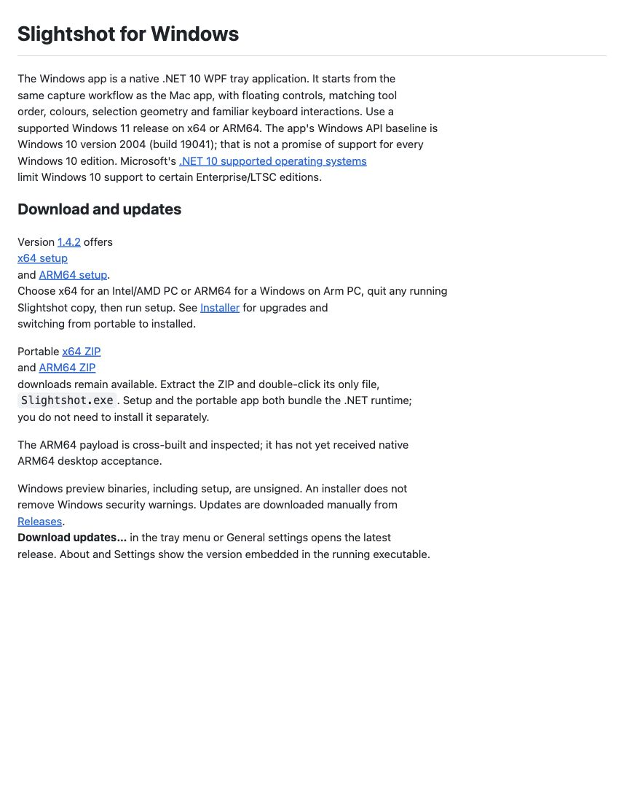
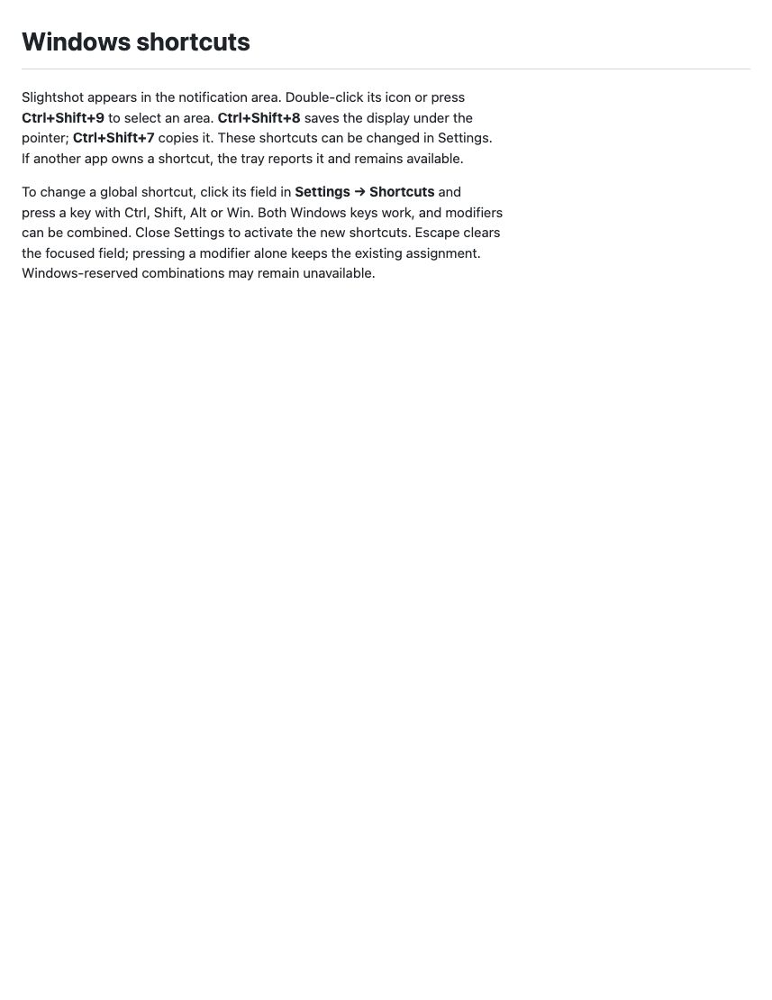
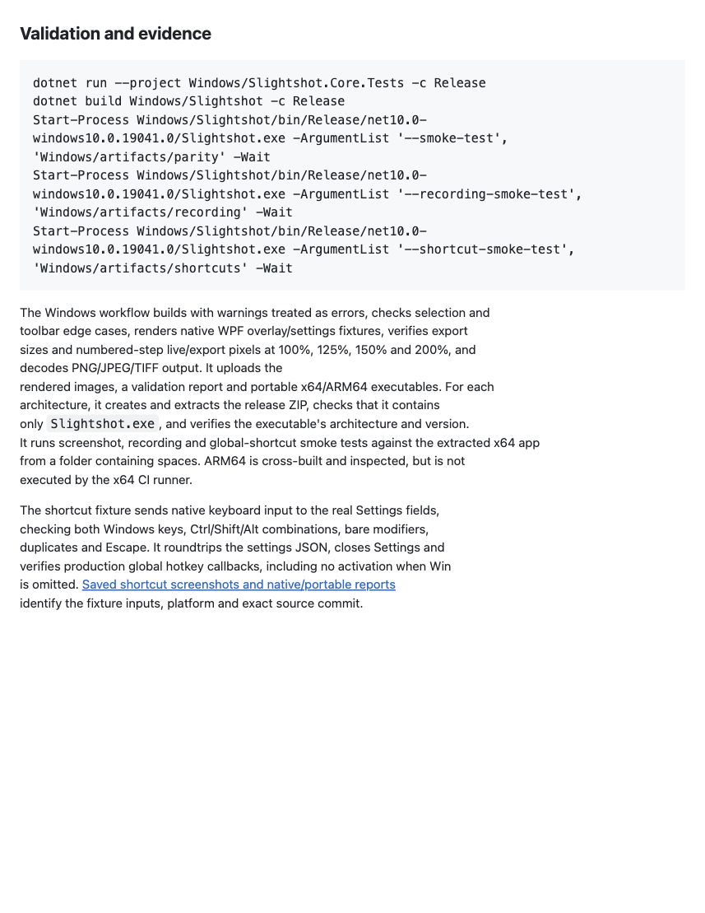
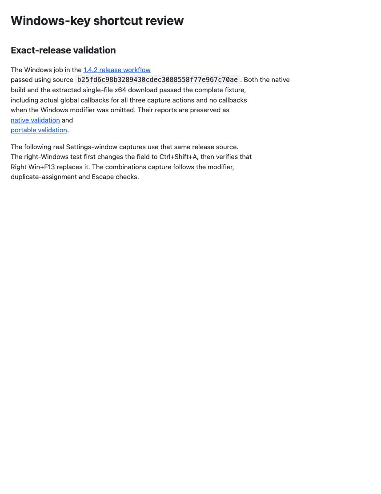
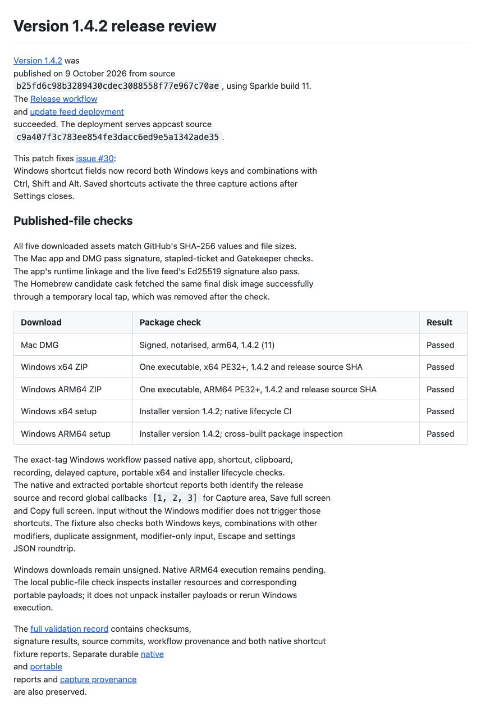

# Version 1.4.2 release review

[Version 1.4.2](https://github.com/jmpijll/slightshot/releases/tag/v1.4.2) was
published on 9 October 2026 from source
`b25fd6c98b3289430cdec3088558f77e967c70ae`, using Sparkle build 11.
The [Release workflow](https://github.com/jmpijll/slightshot/actions/runs/37989426323)
and [update feed deployment](https://github.com/jmpijll/slightshot/actions/runs/37990485558)
succeeded. The deployment serves appcast source
`c9a407f3c783ee854fe3dacc6ed9e5a1342ade35`.

This patch fixes [issue #30](https://github.com/jmpijll/slightshot/issues/30):
Windows shortcut fields now record both Windows keys and combinations with
Ctrl, Shift and Alt. Saved shortcuts activate the three capture actions after
Settings closes.

## Published-file checks

All five downloaded assets match GitHub's SHA-256 values and file sizes.
The Mac app and DMG pass signature, stapled-ticket and Gatekeeper checks.
The app's runtime linkage and the live feed's Ed25519 signature also pass.
The Homebrew candidate cask fetched the same final disk image successfully
through a temporary local tap, which was removed after the check.

| Download | Package check | Result |
| --- | --- | --- |
| Mac DMG | Signed, notarised, arm64, 1.4.2 (11) | Passed |
| Windows x64 ZIP | One executable, x64 PE32+, 1.4.2 and release source SHA | Passed |
| Windows ARM64 ZIP | One executable, ARM64 PE32+, 1.4.2 and release source SHA | Passed |
| Windows x64 setup | Installer version 1.4.2; native lifecycle CI | Passed |
| Windows ARM64 setup | Installer version 1.4.2; cross-built package inspection | Passed |

The exact-tag Windows workflow passed native app, shortcut, clipboard,
recording, delayed capture, portable x64 and installer lifecycle checks.
The native and extracted portable shortcut reports both identify the release
source and record global callbacks `[1, 2, 3]` for Capture area, Save full screen
and Copy full screen. Input without the Windows modifier does not trigger those
shortcuts. The fixture also checks both Windows keys, combinations with other
modifiers, duplicate assignment, modifier-only input, Escape and settings
JSON roundtrip.

Windows downloads remain unsigned. Native ARM64 execution remains pending.
The local public-file check inspects installer resources and corresponding
portable payloads; it does not unpack installer payloads or rerun Windows
execution.

The [full validation record](../v1.4.2-validation.json) contains checksums,
signature results, source commits, workflow provenance and both native shortcut
fixture reports. Separate durable [native](../../windows-key-shortcuts/native-shortcut-validation.json)
and [portable](../../windows-key-shortcuts/portable-shortcut-validation.json)
reports and [capture provenance](../../windows-key-shortcuts/capture-source.json)
are also preserved.

## Native Windows review evidence

Actual WPF Settings windows on the isolated Windows Server 2025 desktop, source
`b25fd6c98b3289430cdec3088558f77e967c70ae`. The automated fixture sends real
keyboard input and captures composed desktop pixels cropped to the Settings
window. Fixture settings are held in memory; no personal settings are read or
saved.

## Rendered review evidence

The changed documentation and measured validation results below are actual
source excerpts rendered with the GitHub Markdown API in a local browser.
The documentation source commit, file hashes and capture hashes are recorded
in [capture-source.json](capture-source.json).

