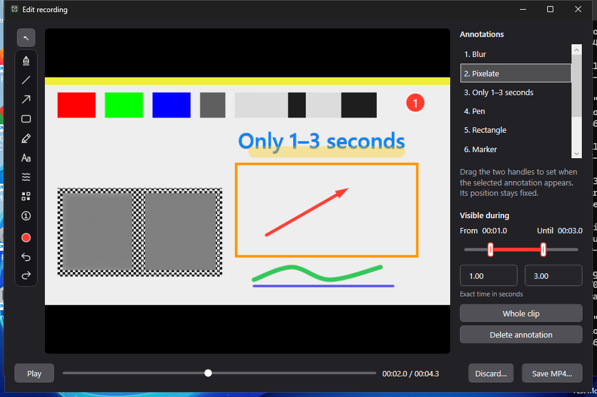
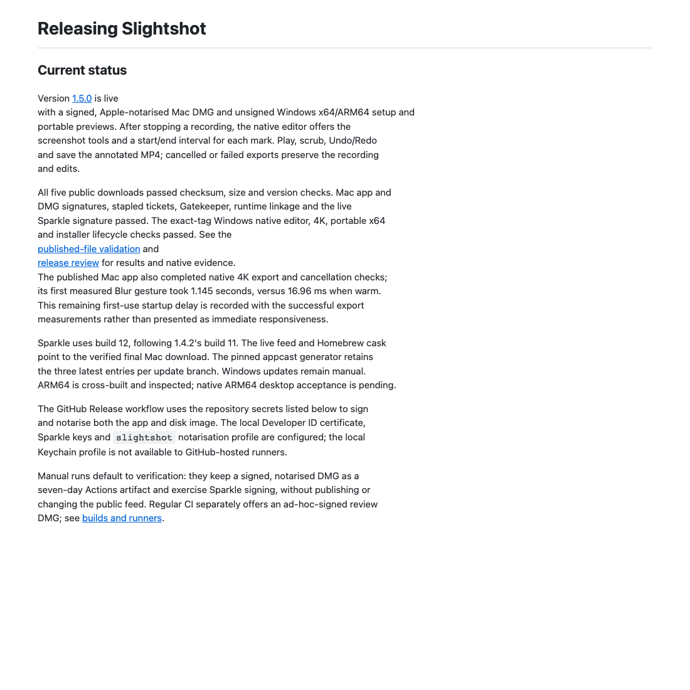
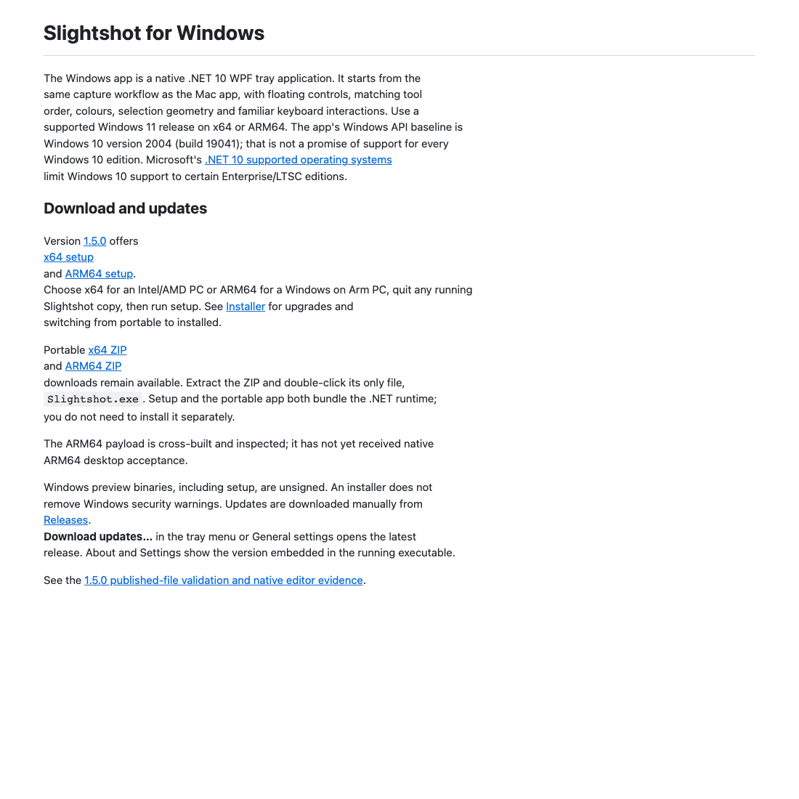
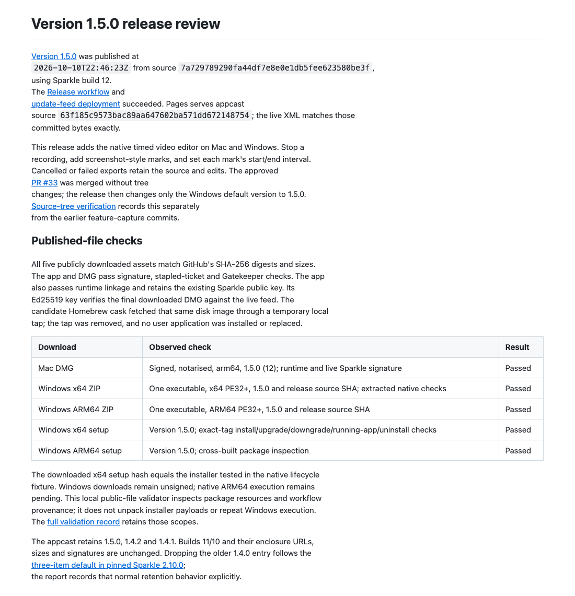

# Version 1.5.0 release review

[Version 1.5.0](https://github.com/jmpijll/slightshot/releases/tag/v1.5.0) was published at
`2026-10-10T22:46:23Z` from source `7a729789290fa44df7e8e0e1db5fee623580be3f`,
using Sparkle build 12.
The [Release workflow](https://github.com/jmpijll/slightshot/actions/runs/38092022509) and
[update-feed deployment](https://github.com/jmpijll/slightshot/actions/runs/38092667457) succeeded. Pages serves appcast
source `63f185c9573bac89aa647602ba571dd672148754`; the live XML matches those
committed bytes exactly.

This release adds the native timed video editor on Mac and Windows. Stop a
recording, add screenshot-style marks, and set each mark's start/end interval.
Cancelled or failed exports retain the source and edits. The approved
[PR #33](https://github.com/jmpijll/slightshot/pull/33) was merged without tree
changes; the release then changes only the Windows default version to 1.5.0.
[Source-tree verification](source-tree-verification.json) records this separately
from the earlier feature-capture commits.

## Published-file checks

All five publicly downloaded assets match GitHub's SHA-256 digests and sizes.
The app and DMG pass signature, stapled-ticket and Gatekeeper checks. The app
also passes runtime linkage and retains the existing Sparkle public key. Its
Ed25519 key verifies the final downloaded DMG against the live feed. The
candidate Homebrew cask fetched that same disk image through a temporary local
tap; the tap was removed, and no user application was installed or replaced.

| Download | Observed check | Result |
| --- | --- | --- |
| Mac DMG | Signed, notarised, arm64, 1.5.0 (12); runtime and live Sparkle signature | Passed |
| Windows x64 ZIP | One executable, x64 PE32+, 1.5.0 and release source SHA; extracted native checks | Passed |
| Windows ARM64 ZIP | One executable, ARM64 PE32+, 1.5.0 and release source SHA | Passed |
| Windows x64 setup | Version 1.5.0; exact-tag install/upgrade/downgrade/running-app/uninstall checks | Passed |
| Windows ARM64 setup | Version 1.5.0; cross-built package inspection | Passed |

The downloaded x64 setup hash equals the installer tested in the native lifecycle
fixture. Windows downloads remain unsigned; native ARM64 execution remains
pending. This local public-file validator inspects package resources and workflow
provenance; it does not unpack installer payloads or repeat Windows execution.
The [full validation record](../v1.5.0-validation.json) retains those scopes.

The appcast retains 1.5.0, 1.4.2 and 1.4.1. Builds 11/10 and their enclosure URLs,
sizes and signatures are unchanged. Dropping the older 1.4.0 entry follows the
[three-item default in pinned Sparkle 2.10.0](https://github.com/sparkle-project/Sparkle/blob/2.10.0/generate_appcast/main.swift#L77);
the report records that normal retention behavior explicitly.

## Native application evidence

**Mac: downloaded, signed 1.5.0 / build 12 application.** The app was
copied intact from the verified, read-only mounted public DMG into an isolated
temporary bundle. Its signature was checked again; the executable SHA-256 stayed
identical. No bundle metadata, framework or signature changed, and the existing
user app remained running.

The built-in automated fixture operates actual AppKit toolbar, mouse, text,
interval and seek controls. ScreenCaptureKit captures the real window. The
3840 × 2160 synthetic source is the same 48-frame / 24 fps movie as the earlier
review, SHA-256 `8f3798dfc34dd3fdfcba54f6277b90fbb884eb18eff8767b457f51a5ce0c5f5d`.
Fixture account details are invented. The source label is tied to the exact-tag
build provenance; it is not a claim that the Mac executable embeds a commit ID.

High exported in 2.263 seconds with a sampled RSS peak of
318.4 MiB; Balanced in
2.724 seconds / 341.9 MiB.
The maximum export heartbeat gap was 54.4 ms.
Active cancellation took 101.8 ms,
retaining source, destination and all five marks and removing staged output.

Independent ffprobe decoding found **48 frames, uniform 24 fps and 2.000-second
coverage** in both actual outputs, with identical source/output timestamps.
High remains 3840 × 2160; Balanced is 1920 × 1080. This separate decoding check
covers counts, dimensions and timing; it does not rerun privacy-pixel or color
analysis from the earlier independent review.

[Before](mac-native/mac-4k-before.png) · [During](mac-native/mac-4k-during.png) ·
[After](mac-native/mac-4k-after.png) · [Synthetic source](mac-native/fixture-source.mp4) ·
[Native fixture report](mac-native/4k-performance.json) ·
[Published-binary provenance](mac-native/published-binary-provenance.json) ·
[Decoded media validation](mac-native/media-validation/published-mac-media-validation.json) ·
[Reproduction script](mac-native/media-validation/validate_published_mac_media.py) ·
[High MP4](mac-native/edited-4k-2.mp4) · [Balanced MP4](mac-native/edited-4k-1.mp4)

**First-use observation:** the first measured Blur gesture in this published-app
run took **1145.4 ms**,
versus **16.96 ms** for the repeated warm gesture.
The fixture starts after a 150 ms preview wait; background preparation has no
completion barrier. Overlap with startup work is plausible, but this run has no
stack sample or warmup telemetry to prove that cause. These results do not claim
instant first-use responsiveness. [Scoped observation](mac-native/first-blur-observation.md).

**Windows: exact-tag native x64 WPF fixture and extracted portable x64.**
Release source `7a729789290fa44df7e8e0e1db5fee623580be3f`. The native fixture sends real pointer
input for the arrow and uses labelled synthetic inputs for the remaining tools;
native timing controls are automated. The image contains composed desktop pixels
cropped to the actual editor HWND. No personal recording or settings are used.

The release 4K fixture exported 50 frames from its short
1.6417-second source in 3.361 seconds
(14.87 fps). Whole-fixture private memory peaked
at 1314.0 MiB, the dispatcher gap at
85.0 ms, and active cancellation at
100.8 ms. All unchanged 4K gates passed:
at least 8 fps, at most 1536 MiB / 250 ms / 5-second cancellation.
Mac RSS and Windows private-memory samples measure different things and are not
a direct cross-platform memory comparison. Short synthetic runs do not guarantee
performance for every machine or recording duration.

Native and portable fixtures separately pass nominal source RGB, six exact
source-counter seeks including end/back, untouched endpoint precision and timing
Undo. Both actual MP4 and recovery paths are exercised. [Windows summary](windows-release/windows-release-validation-summary.json),
[native editor](windows-release/video-editor/video-editor-validation.json),
[portable editor](windows-release/video-editor/portable/video-editor-validation.json),
[4K report](windows-release/4k/video-editor-4k-validation.json) and
[installer lifecycle](windows-release/installer/installer-validation.json) remain
in this durable review directory; original Actions artifacts can expire.

## Checks separate from visual evidence

Main source `7a729789290fa44df7e8e0e1db5fee623580be3f` passed
[CI](https://github.com/jmpijll/slightshot/actions/runs/38091461479) and
[Windows](https://github.com/jmpijll/slightshot/actions/runs/38091461502):
59 Swift tests in 16 suites, 422 Core checks, 14 release-script checks,
20 shared icon checks, strict lint/build/bundle validation and native Windows
editor, recording, portable and installer checks. The exact-tag Release workflow
repeats the Windows acceptance and actual Apple notarisation gates. Public-file,
Homebrew, signed-Mac native and independently decoded media checks above are
separate from those workflow and screenshot results.

## Rendered review evidence

These are final committed documentation excerpts rendered with GitHub's Markdown
API and captured in a local browser. The documentation commit, file hashes and
image hashes are recorded in [capture-source.json](capture-source.json).

