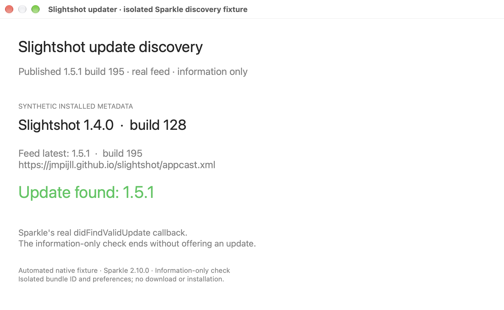
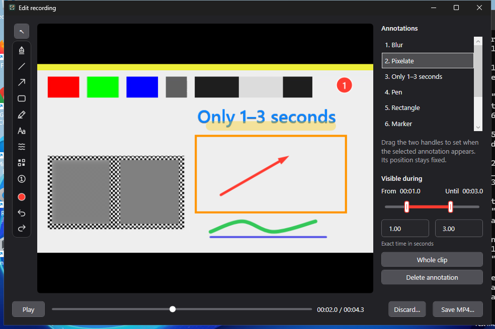

# Slightshot 1.5.1 release verification

[Issue #34](https://github.com/jmpijll/slightshot/issues/34) · [Fix PR #35](https://github.com/jmpijll/slightshot/pull/35) · [Release](https://github.com/jmpijll/slightshot/releases/tag/v1.5.1).

Release source: **293830bcc78ab98ecb174fedb0ed05d2cd5913d1**. Mac marketing version **1.5.1**, internal build **195**, derived from the full source Git history. The merged tree equals the approved PR head f66e30d. The updater fix changes release metadata and publication checks; native editor code is unchanged from 1.5.0.

## Published native updater discovery

Actual macOS 27 AppKit diagnostic windows with the pinned Sparkle 2.10.0 SDK. Automated information-only checks use isolated synthetic installed metadata for 1.4.0/build 128 (matching the affected running app), 162 and public build 9. Each case reads the real published feed and selects **1.5.1/build 195**. The capture/provenance identifies the actual framework, fixture binary, feed and image hashes. This fixture is ad-hoc signed and is not an unmodified release application. No payload is downloaded or installed by these discovery checks.

[Complete live matrix/provenance](mac-native/published-provenance.json) includes build 162 and build 9.

The earlier [before/candidate evidence](../../updater-build-numbering/README.md) remains separate: build 128 rejected published 1.5.0/build 12; it accepted a prepublication candidate build 192. Those candidate inputs do not claim a public signed enclosure. This section uses the actual final build 195.

A manual check in the actual existing **1.4.0 (128)** app also displayed “Slightshot 1.5.1 is now available—you have 1.4.0.” The update window was closed without installing or skipping the version. Its loaded binary source cannot be inferred from the subsequently rebuilt on-disk bundle. [Observed native accessibility result and interaction scope](actual-running-app-validation.json).

## Public payload and trust checks

All five published files are independently downloaded and checked against GitHub asset sizes/digests and exact-tag Windows release artifact hashes. The Mac payload is checked for version/build/source, Developer ID signatures, stapled app/DMG tickets, Gatekeeper and runtime linkage. The live feed must match its committed/deployed bytes and authenticate the final DMG with Ed25519, including with the key embedded in the immutable public 1.4.0 application. Existing 1.5.0/build 12 and 1.4.2/build 11 entries remain valid. The candidate Homebrew cask fetches the same final file through a temporary local validation tap, which is removed afterward.

[Published-file validation](../v1.5.1-validation.json) records the results separately from the captures. Homebrew fetch and all public trust checks passed. The temporary validation tap was removed; no application was installed or replaced.

## Windows exact-tag native evidence

Windows updates continue to open GitHub's latest release; no automatic availability comparator or Windows updater behavior changes. [Source-linked route validation](../../updater-build-numbering/windows/update-route-validation.json).

Actual native HWND capture from the exact-tag x64 WPF app, using synthetic footage and labelled automated pointer/timing inputs. [Tag-native validation summary](windows-release/windows-release-validation-summary.json) and [public payload/latest-route summary](windows-release/windows-public-assets-and-route-summary.json). The unchanged update link resolves to 1.5.1.

The tag-run 4K benchmark measured **16.38 fps**, **1308.79 MiB** whole-fixture peak private memory, **77.99 ms** maximum dispatcher gap and **73.07 ms** active cancellation. All unchanged acceptance gates passed. Raw 4K, editor and installer validation JSON is retained below `windows-release/`.

The Windows x64 native editor/4K and extracted-portable checks pass, as do installation, upgrade, downgrade rejection, running-app guard, settings preservation and uninstallation checks. ARM64 packages are cross-built and inspected; native ARM64 desktop acceptance remains pending. Windows downloads remain unsigned previews.

## CI

- [PR Mac/Linux](https://github.com/jmpijll/slightshot/actions/runs/38098175798) and [PR Windows](https://github.com/jmpijll/slightshot/actions/runs/38098175766): success on approved head f66e30d.
- [Merged-source Mac/Linux](https://github.com/jmpijll/slightshot/actions/runs/38098632835) and [merged-source Windows](https://github.com/jmpijll/slightshot/actions/runs/38098632849): success on release source 293830b.
- [Exact-tag Release](https://github.com/jmpijll/slightshot/actions/runs/38098651456): success; exact-tag Windows checks passed before Mac signing, notarisation and publication.
- [Feed deployment](https://github.com/jmpijll/slightshot/actions/runs/38099264032): success on appcast source `6b0d7452d8477d2f8ac1e420eb6bec0b572aa65e`, with live feed bytes independently verified.

The 24 Python checks include ten release-metadata regression tests. They execute the real Resolve version shell step against actual Git histories, covering the original counter mismatch and stale checkout versus newer canonical feed without moving source HEAD. Workflow lint and evidence hash checks pass.

The previously observed first-use Mac Blur delay remains documented in the [1.5.0 review](../v1.5.0/README.md); this updater patch does not change the video pipeline. The short synthetic Windows tag-run benchmark is evidence for that run, rather than a guarantee for every recording or computer.
