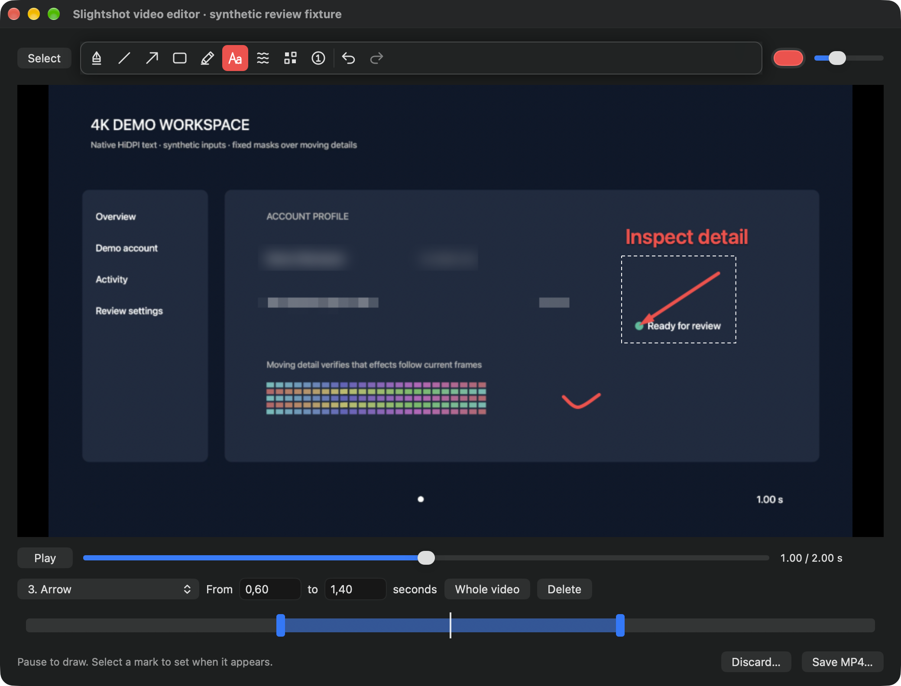
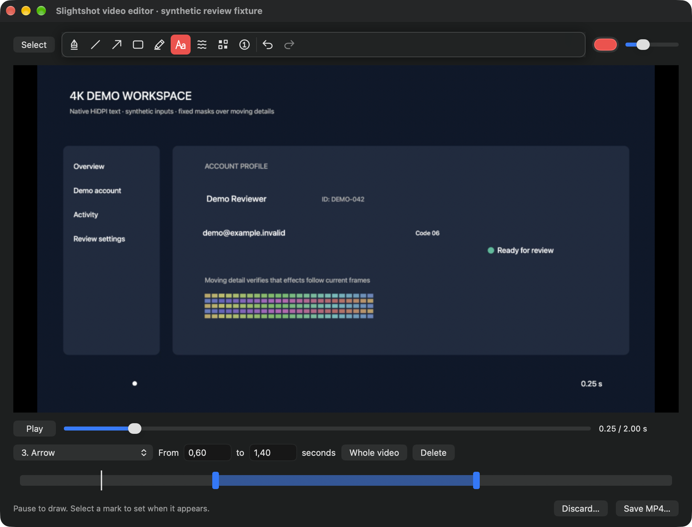
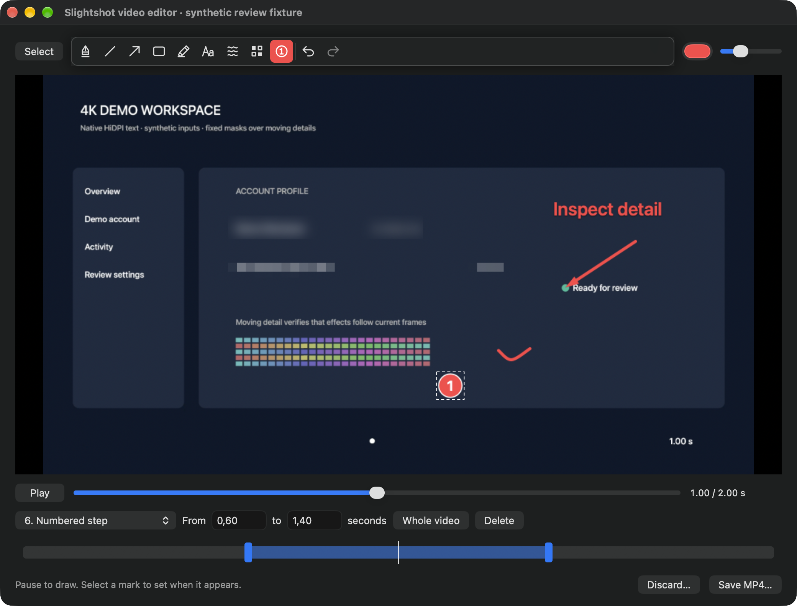
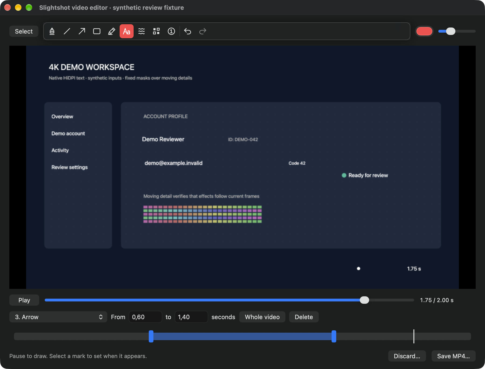
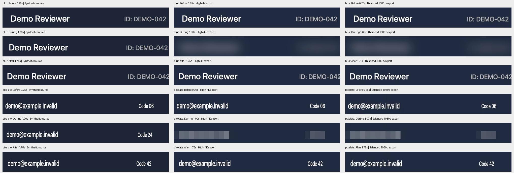

# Native 4K acceptance

This record tests the working video editor with synthetic 3840 × 2160 movies,
native pointer input, timed privacy effects and real MP4 exports. It extends the
[original editor evidence](../README.md). All account names and codes are invented.
The screenshots capture running application windows, and the interactions are
automated review fixtures.

## What changed

At a small fit scale, the original blur radius, pixel blocks and numbered steps
shrunk with the source image. New video marks store the inverse creation scale,
so their visible strength/size matches the screenshot tools. Resizing the window
preserves that mark's existing source geometry and strength. Export uses the same
stored values at the requested output resolution.

Windows exports now decode successive source frames on an owned Media Foundation
worker instead of requesting and converting a separate thumbnail for every frame.
Privacy effects operate directly on bounded BGRA regions, static vector patches
are prepared once, and the blur's vertical pass walks contiguous scanlines.
Preview decoding is bounded to 1280 pixels while annotation coordinates remain
in the full source image.

Mac prepares the shared Core Image blur pipeline on a worker when the first
preview is available. The export path uses cancellable native append readiness
instead of an async receiver that could stall indefinitely. The original
encoder stall and first-blur investigation are retained separately:
[encoder reproduction](../mac/encoder-readiness.md),
[first-blur measurements and native profile](../mac/blur-startup.md).

## Measurement limits

These are short, specified acceptance workloads on one Mac and hosted Windows
CI. They establish actual 4K behavior and catch the observed regressions; they
are not a benchmark for every GPU or long recording. Mac and Windows use
different movies, effects and memory counters, so their timings are not directly
comparable. A cancelled export must retain the source, an existing destination
and all annotation state, and remove its private staging files.

The Mac baseline and current run reuse the exact same two-second H.264 file,
48 source frames at 24 fps, with five native marks visible during 0.6–1.4 seconds.
High exports 3840 × 2160 with a 30 fps cap; Balanced exports 1920 × 1080 with
a 24 fps cap. Both preserve this 24 fps source without adding duplicate frames.
Memory is resident size sampled every 50 ms during each export. The heartbeat
measures main-actor scheduling during export, including preparation, rather than
an independent input-latency guarantee. Shader caches were not reset.

The Windows workload records a synthetic moving 4K source for 1.6 seconds,
then exports three marks at High/30 fps, visible during 0.35–1.1 seconds.
The current fixture adds invented readable text to the baseline's checker
pattern. Its workload is slightly richer, so before/after numbers describe the
observed runs rather than a strictly identical-input speedup. Windows memory is
private bytes sampled every 40 ms across the whole fixture; phase peaks are
reported too. A 16 ms dispatcher timer runs through editor/export validation.

Separate Step interactions occur after the primary performance measurement on
both platforms and do not change its annotation workload.

## macOS results and native evidence

Captured on macOS 27 / Apple M4 / 16 GiB RAM from source
`3885ab05d1358839068d9ee9bb05d0c6c688853d`, with fixture instrumentation
SHA-256 `ae195ac7077359627e5b8e89614c9955eba303628d43dcae8370a5323d5b32d2`.
An isolated ad-hoc signed bundle runs the actual AppKit editor. The fixture uses
native toolbar clicks, `NSEvent` gestures, timing controls and seeks; ScreenCaptureKit
captures the real window. Source SHA-256
`8f3798dfc34dd3fdfcba54f6277b90fbb884eb18eff8767b457f51a5ce0c5f5d` matches the
baseline at product `b6d8535ea1c5195a454530b82f14c686d7470949` exactly.

| Measurement | Baseline | Current |
| --- | ---: | ---: |
| High export, 2 s of 4K source | 2.679 s | 2.443 s |
| Balanced export | 2.751 s | 2.823 s |
| High sampled resident peak | 394.02 MiB | 345.50 MiB |
| Balanced sampled resident peak | 304.67 MiB | 272.94 MiB |
| First native Blur gesture and draw | 214.21 ms | 16.44 ms |
| Seek/draw before, during, after | 69 / 150 / 111 ms | 58 / 108 / 140 ms |
| Repeated identical Blur gesture | Not measured | 13.93 ms |
| Largest export heartbeat gap, 50 ms timer | Not measured | 54.21 ms |
| Native cancellation during active output | Not measured | 102.77 ms |

These are individual observed runs. An earlier fresh-process first Blur took
1153 ms and a rerun took 52 ms; the [startup diagnosis](../mac/blur-startup.md)
retains that variability, native profile and ten-pair isolated prewarm comparison.
The final capture verifies an actual decoded 960 × 540 preview, with radius
8.276 preview pixels / 8 canvas points and 12-point pixelation blocks. Export
retains that strength at full resolution.

| Original 4K strength, at 1 s | Corrected strength, at 1 s |
| --- | --- |
|  |  |

| Before: 0.25 s | During with additional Step: 1 s | After: 1.75 s |
| --- | --- | --- |
|  |  |  |

[Current performance/cancellation report](mac/current/4k-performance.json) ·
[Baseline report](mac/baseline/4k-performance.json) ·
[Synthetic source](mac/current/fixture-source.mp4) ·
[Actual 4K High MP4](mac/current/edited-4k-2.mp4) ·
[Actual Balanced MP4](mac/current/edited-4k-1.mp4)

The cancellation fixture presses the real export panel's Cancel button after
57,732 bytes exist in AVFoundation's private media-buffer file. Source and
existing destination hashes and all five annotations remain unchanged; staging
is removed. The numbered Step is a separate native toolbar/click capture after
this workload, with a 32-point diameter and 36-point padded dirty bounds.

The old baseline report's `outputFPS`/`expectedOutputFrames` fields describe
the requested cap, not independently counted decoded output. The earlier High
file has 48 frames rather than 60, with an average of 24 fps and intervals rounded
onto a 30 fps grid. The [timing regression and fix](../mac/source-cadence.md)
explain why the new High output preserves the regular 24 fps cadence instead.

Independent [decoded-frame and pixel validation](mac/current/media-validation/media-validation.json)
counts exactly 48 frames over 2.000 seconds in both outputs. Their presentation
timestamps match the source, uniformly 1/24 s apart within 0.667 microseconds of
probe rounding. Privacy effects are absent before/after their interval. During
it, the displayed exports differ from the production screenshot-strength
reference by only 5.46 mean RGB levels for blur and 7.69 for pixelation, including
H.264 and resampling differences. These checks measure visible effect strength;
they do not establish resistance to an OCR or de-anonymization adversary.

The following contact sheet crops decoded source and actual MP4 frames at exact
frame indices 6, 24 and 42. It contains invented text and is a labelled video
validation image; the native editor captures above establish the UI behavior.



## Windows memory diagnosis

The original 4K workload failed acceptance at 1.07 exported fps, a 1112 ms
dispatcher gap and 2226 MiB peak private memory. Sequential decoding and direct
pixel composition improved the observed export to about 11.4 fps and dispatcher
gaps below 100 ms, but the native memory limit still failed.

The [native export trace](windows/diagnosis/native-export-memory.json) records
process private/working memory alongside managed live/committed/allocated memory
and collection counts. A separate [classic-decoder isolation run](windows/diagnosis/classic-decoder-memory.json)
warms the source decoder before starting the writer. Its private memory is
593 MiB after decoder warmup, 605 MiB after preparing the writer, 846 MiB after
the first submitted frame and 1644 MiB by frame 15; managed live memory stays
near 194–234 MiB. The four output buffers and two decoder lookahead buffers are
bounded. This places the remaining large native allocation in the writing phase,
without distinguishing the bridge queue, converter pool and encoder internals.
The classic reader also reduced throughput to 6.4 fps, so switching the reader
alone is not a sufficient fix. Both failed reports retain their acceptance flags.

The classic path exposed H.264's coded 640 × 368 buffer around a visible
640 × 360 frame. The decoder now validates integer display apertures against the
expected visible dimensions and copies within the actual native buffer footprint,
including negative stride. Native 640-pixel fixtures pass with that correction.

## Checks separate from visual evidence

- Mac: 58 Swift tests in 16 suites, strict SwiftLint, warning-free release bundle.
  Real native pointer tests compare 4K blur/pixelation and Step sizes with the
  screenshot tools, preserve strength after resizing, and compare preview and
  prepared export rendering. Media tests cover interval boundaries, current-frame
  privacy effects, quality caps, uniform slower-source cadence, replacement and
  cancellation. The native encoder
  reproduction completed 500 jobs / 150,000 frames; 50 annotated in-flight
  cancellation repetitions also completed.
- Windows: 221 portable Core checks and a warning-free release crossbuild.
  [288 SHA-256 comparisons](windows/blur-byte-equivalence.json) confirm the
  optimized blur is byte-identical to the previous kernel across dimensions,
  edge radii, alpha values and a 4K case. Native CI exercises Media Foundation
  buffer layout, orientation, moving-frame freshness, quality/timing, actual
  pointer drawing, active cancellation, retry and Step output.
- Windows 4K gates remain enforced: at least 8 exported fps; at most 250 ms
  dispatcher gap, 1.5 GiB private memory and 5 seconds cancellation; screenshot
  strength comparison within 18 mean channel values and a 32-point Step.
  Only the explicitly dispatched baseline disables these acceptance failures.
- CI also checks the 20 shared icons, 14 Python packaging tests, recording and
  editor fixtures, extracted portable x64 binaries, x64/ARM64 package generation,
  installer upgrades/downgrades and uninstall behavior.

## Reproduce

Build an isolated Mac review bundle with `SIGN_IDENTITY=- ./Scripts/bundle.sh`,
give it a separate bundle identifier if another instance is running, and launch:

```sh
open -n --env SLIGHTSHOT_REVIEW_SOURCE_COMMIT=<capture-source-commit> \
  --env SLIGHTSHOT_REVIEW_FIXTURE_SHA256=<VideoEditor4KReview.swift-sha256> \
  <isolated-Slightshot.app> --args \
  --video-editor-review <output-directory> --video-editor-4k-evidence \
  --video-editor-review-source <synthetic-fixture-source.mp4>
```

On Windows, the PR workflow runs the same command used locally:

```powershell
$env:SLIGHTSHOT_SOURCE_COMMIT = git rev-parse HEAD
Slightshot.exe --video-editor-4k-benchmark <output-directory>
```

The workflow uploads `windows-native-4k-benchmark-evidence` immediately after the
benchmark, including failure reports. Durable copies here remain available after
CI artifacts expire. Original baseline reports remain unchanged.
