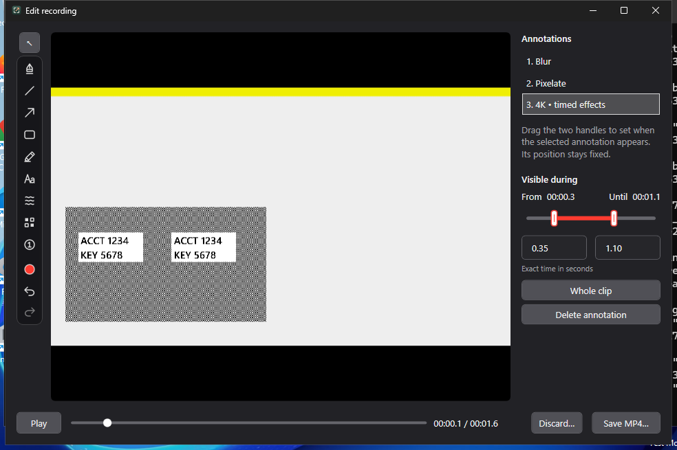
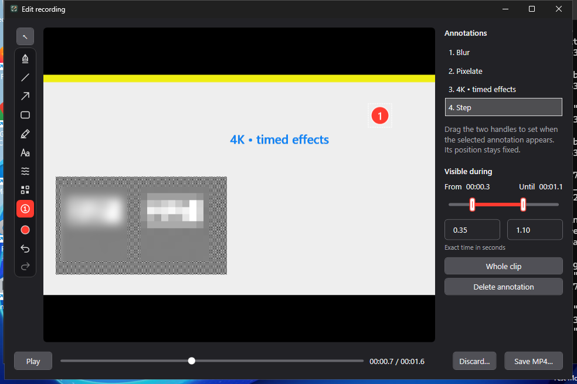
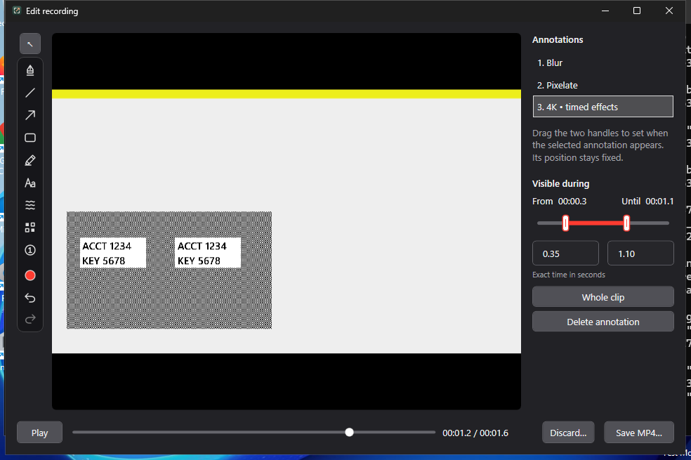
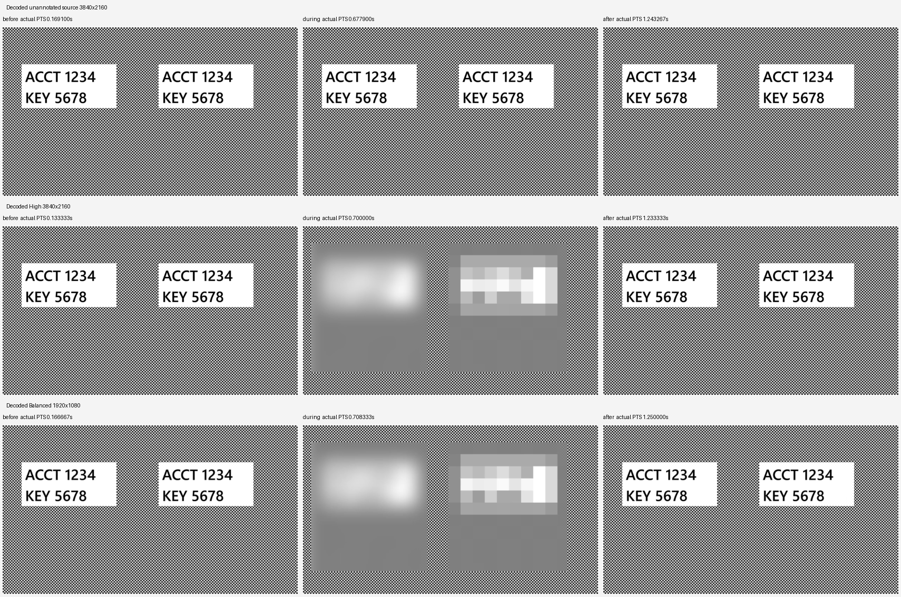

# Native 4K acceptance

This record tests the working video editor with synthetic 3840 × 2160 movies,
native pointer input, timed privacy effects and real MP4 exports. It extends the
[original editor evidence](../README.md). All account names and codes are invented.
The screenshots capture running application windows, and the interactions are
automated review fixtures.

## What changed

At a small fit scale, the original blur radius, pixel blocks and numbered steps
shrunk with the source image. New video marks store the inverse creation scale,
so their visible strength/size matches the screenshot tools. Resizing the window
preserves that mark's existing source geometry and strength. Export uses the same
stored values at the requested output resolution.

Windows exports now decode successive source frames on an owned Media Foundation
worker instead of requesting and converting a separate thumbnail for every frame.
Privacy effects operate directly on bounded BGRA regions, static vector patches
are prepared once, and the blur's vertical pass walks contiguous scanlines.
Displayed preview bitmaps are bounded to 1280 pixels while annotation coordinates
remain in the full source image.
The preview uses the same explicit native NV12-to-BGRA conversion as export,
with supported native random seeks and background decoder disposal. Known
original RGB values and independently decoded MP4s validate color beyond
agreement between those shared conversion paths.

The annotated export now writes each completed frame directly to a native Media
Foundation Sink Writer on an owned MTA thread. Default writer throttling provides
backpressure before the next frame is submitted. One managed composition buffer
and two decoder lookahead buffers are reused; each native sample owns its copy.
The three source-sized BGRA buffers now use exact-length leases from a cache
capped at three idle buffers / 100 MiB, avoiding bucket rounding and repeated
full-frame allocation between exports. Buffers return only after the owning
workers and native requests finish. The NV12 conversion buffer and lower-quality
resize buffer are reused within each export.
For lower qualities, a cached bilinear mapping downsizes the completed source
frame before encoding, avoiding a separate native 4K conversion graph. Native
writer queue bytes and resize/write timings are measured rather than inferred.
The reusable output buffer is converted directly to limited-range BT.709 NV12
before submission, avoiding the writer's full-resolution RGB conversion surfaces.
SIMD and scalar conversion paths share tested Y/UV byte values and 2 × 2 chroma
averaging. The source decoder also delivers native NV12 directly. Validated locked Y/UV
planes are converted into the existing BGRA lookahead leases, avoiding a native
full-resolution RGB decode graph and an extra NV12 copy. Negotiated matrix/range
are recorded; explicit BT.601/BT.709 and limited/full range are supported, with
specified SDR defaults (unknown MF matrix becomes BT.709; unknown range is limited
for the app's SDR H.264 source) and rejection of unsupported layouts/HDR metadata.
Recording now converts captured BGRA directly to limited-range BT.709 NV12 before
submitting source samples. One reusable BGRA scratch is used under the existing
sample semaphore; bounded NV12 leases remain owned by native samples until
`Processed`. The scratch reference is released after admitted callbacks drain.
Recording input and H.264 output declare the same explicit color format before
native preparation. Known source RGB/gray patches check actual conversion against
the original fixture values as well as both decoders.
The native encoder's worker/B-frame settings and submitted/encoded sample counts
are read back. For annotated exports, a reported encoded-count mismatch aborts
publication. Native fixtures also independently decode and count each output;
the runtime count guard depends on encoder statistics being available.

Mac prepares the shared Core Image blur pipeline on a worker when the first
preview is available. The export path uses cancellable native append readiness
instead of an async receiver that could stall indefinitely. The original
encoder stall and first-blur investigation are retained separately:
[encoder reproduction](../mac/encoder-readiness.md),
[first-blur measurements and native profile](../mac/blur-startup.md).

## Measurement limits

These are short, specified acceptance workloads on one Mac and hosted Windows
CI. They establish actual 4K behavior and catch the observed regressions; they
are not a benchmark for every GPU or long recording. Mac and Windows use
different movies, effects and memory counters, so their timings are not directly
comparable. A cancelled export must retain the source, an existing destination
and all annotation state, and remove its private staging files.

The Mac baseline and current run reuse the exact same two-second H.264 file,
48 source frames at 24 fps, with five native marks visible during 0.6–1.4 seconds.
High exports 3840 × 2160 with a 30 fps cap; Balanced exports 1920 × 1080 with
a 24 fps cap. Both preserve this 24 fps source without adding duplicate frames.
Memory is resident size sampled every 50 ms during each export. The heartbeat
measures main-actor scheduling during export, including preparation, rather than
an independent input-latency guarantee. Shader caches were not reset.

The Windows workload records a synthetic moving 4K source for 1.6 seconds,
then exports three marks at High/30 fps, visible during 0.35–1.1 seconds.
The current fixture adds invented readable text to the baseline's checker
pattern. Its workload is slightly richer, so before/after numbers describe the
observed runs rather than a strictly identical-input speedup. Windows memory is
private bytes sampled every 40 ms across the whole fixture; phase peaks are
reported too. A 16 ms dispatcher timer measures the editor and primary High
export; it stops before output validation, cancellation and Step. Balanced has
its own export timer. These scheduling gaps do not measure all input latency.

Separate Step interactions occur after the primary performance measurement on
both platforms and do not change its annotation workload.

## macOS results and native evidence

Captured on macOS 27 / Apple M4 / 16 GiB RAM from source
`3885ab05d1358839068d9ee9bb05d0c6c688853d`, with fixture instrumentation
SHA-256 `ae195ac7077359627e5b8e89614c9955eba303628d43dcae8370a5323d5b32d2`.
An isolated ad-hoc signed bundle runs the actual AppKit editor. The fixture uses
native toolbar clicks, `NSEvent` gestures, timing controls and seeks; ScreenCaptureKit
captures the real window. Source SHA-256
`8f3798dfc34dd3fdfcba54f6277b90fbb884eb18eff8767b457f51a5ce0c5f5d` matches the
baseline at product `b6d8535ea1c5195a454530b82f14c686d7470949` exactly.

| Measurement | Baseline | Current |
| --- | ---: | ---: |
| High export, 2 s of 4K source | 2.679 s | 2.443 s |
| Balanced export | 2.751 s | 2.823 s |
| High sampled resident peak | 394.02 MiB | 345.50 MiB |
| Balanced sampled resident peak | 304.67 MiB | 272.94 MiB |
| First native Blur gesture and draw | 214.21 ms | 16.44 ms |
| Seek/draw before, during, after | 69 / 150 / 111 ms | 58 / 108 / 140 ms |
| Repeated identical Blur gesture | Not measured | 13.93 ms |
| Largest export heartbeat gap, 50 ms timer | Not measured | 54.21 ms |
| Native cancellation during active output | Not measured | 102.77 ms |

These are individual observed runs. An earlier fresh-process first Blur took
1153 ms and a rerun took 52 ms; the [startup diagnosis](../mac/blur-startup.md)
retains that variability, native profile and ten-pair isolated prewarm comparison.
The final capture verifies an actual decoded 960 × 540 preview, with radius
8.276 preview pixels / 8 canvas points and 12-point pixelation blocks. Export
retains that strength at full resolution.

| Original 4K strength, at 1 s | Corrected strength, at 1 s |
| --- | --- |
|  |  |

| Before: 0.25 s | During with additional Step: 1 s | After: 1.75 s |
| --- | --- | --- |
|  |  |  |

[Current performance/cancellation report](mac/current/4k-performance.json) ·
[Baseline report](mac/baseline/4k-performance.json) ·
[Synthetic source](mac/current/fixture-source.mp4) ·
[Actual 4K High MP4](mac/current/edited-4k-2.mp4) ·
[Actual Balanced MP4](mac/current/edited-4k-1.mp4)

The cancellation fixture presses the real export panel's Cancel button after
57,732 bytes exist in AVFoundation's private media-buffer file. Source and
existing destination hashes and all five annotations remain unchanged; staging
is removed. The numbered Step is a separate native toolbar/click capture after
this workload, with a 32-point diameter and 36-point padded dirty bounds.

The old baseline report's `outputFPS`/`expectedOutputFrames` fields describe
the requested cap, not independently counted decoded output. The earlier High
file has 48 frames rather than 60, with an average of 24 fps and intervals rounded
onto a 30 fps grid. The [timing regression and fix](../mac/source-cadence.md)
explain why the new High output preserves the regular 24 fps cadence instead.

Independent [decoded-frame and pixel validation](mac/current/media-validation/media-validation.json)
counts exactly 48 frames over 2.000 seconds in both outputs. Their presentation
timestamps match the source, uniformly 1/24 s apart within 0.667 microseconds of
probe rounding. Privacy effects are absent before/after their interval. During
it, the displayed exports differ from the production screenshot-strength
reference by only 5.46 mean RGB levels for blur and 7.69 for pixelation, including
H.264 and resampling differences. These checks measure visible effect strength;
they do not establish resistance to an OCR or de-anonymization adversary.

The following contact sheet crops decoded source and actual MP4 frames at exact
frame indices 6, 24 and 42. It contains invented text and is a labelled video
validation image; the native editor captures above establish the UI behavior.


## Windows results and native evidence

Captured from native checkout `e28601319e3107e8681c2af2bea6b8312c5cd1ff` / PR head `0d96e8eece5bcdfc8f24074b61126b230e0dccb0` in
[run 38085300980](https://github.com/jmpijll/slightshot/actions/runs/38085300980).
The WPF screenshots are real HWND pixels. Automated native pointer input creates
the blur/pixelation rectangles and separate Step; caption text, timing and seek
values are labelled fixture inputs. The synthetic source's SHA-256 is
`3aa1d3a61b23ff3d429011f2235085081c39209cb812d1d05b41c2bc1e07e75e`. Its actual duration is 1.6246 seconds.

| Measurement | Baseline | Current |
| --- | ---: | ---: |
| High export, about 1.6 s of 4K source | 44.948 s | 3.357 s |
| Exported frames per second | 1.07 | 14.60 |
| Whole-fixture sampled private peak | 2226.05 MiB | 1302.15 MiB |
| Editor / primary High dispatcher gap, 16 ms timer | 1111.54 ms | 102.59 ms |
| Active cancellation | Not compared | 113.91 ms |

Preview and export both use owned Media Foundation NV12 decoding and the tested
CPU conversion. The editor drains pending preview requests and releases its
native preview decoder before export, retaining the frozen displayed frame,
source metadata and all edits. Cancel/failure reopens decoding lazily on seek/play.
Random seeks preserve the original source timestamp origin and read forward from
a native keyframe at or before the target. A conservative seek position keeps
the exact video-end request inside the native track; six native counter checks
include that final frame and a subsequent backward seek. Known original RGB values and independent
MP4 decoding validate color separately from agreement between the shared paths.
The benchmark calls this same production preparation for High, cancellation,
Balanced and Step. Native recovery tests exercise in-flight preview requests,
failed/cancelled Save, subsequent seek/play and close/source cleanup. No forced
garbage collection or acceptance-limit changes are used.

Three exact source-sized BGRA buffers are leased from a cache bounded to three
idle arrays / 100 MiB. Sequential repeated exports reuse these arrays rather
than allocating another decoder pair and composition frame. They return only
after the owning native and render workers finish; metadata inspection rents none.

The final run passes every unchanged gate, including memory during recording,
preview, High, output validation, active cancellation, Balanced and Step. Native
encoder readback reports two workers and zero B-frames. Decoder diagnostics
record one configured worker via the documented transform attribute; that is a
configuration readback rather than an observed count of runtime threads.
The supported encoder low-latency control is read back as true. Requested
profile, bitrate, dimensions and cadence stay the same; this mode can change
compression decisions, as [Microsoft documents](https://learn.microsoft.com/en-us/windows/win32/medfound/codecapi-avlowlatencymode).
Actual decoded output is checked below; identical compression is not claimed.

| Before: 0.15 s | During with additional Step: 0.7 s | After: 1.25 s |
| --- | --- | --- |
|  |  |  |

[Native complete performance/cancellation report](windows/current/video-editor-4k-validation.json) ·
[Actual 4K High MP4](windows/current/video-editor-4k-high.mp4) ·
[Actual 1080p Balanced MP4](windows/current/video-editor-4k-balanced.mp4) ·
[Synthetic source](windows/current/video-editor-4k-source.mp4)

Independent [frame/packet/timing validation](windows/current/media-validation/media-cadence-validation.json)
counts 49 High frames and 39 Balanced frames,
starting at zero with regular 30 / 24 fps presentation intervals respectively.
The last Balanced frame has an actual partial duration of 41.250000 ms, covering
the source end rather than being dropped. The source recording retains its
legacy positive first timestamp; the edited outputs are normalized to zero.
The shortened final sample means Balanced's average count/duration can exceed
24 even though its presentation cadence is exactly 24 fps.

Frame selection also subtracts the first decoded source timestamp. The previous
comparison against raw timestamps held the first source image twice and omitted
the final image in the observed same-cadence High and Step exports. The raw source timestamps remain visible in inspection reports;
only the source-to-output timeline mapping is normalized, with one 100 ns
lookahead allowance for rational timestamp quantization. Annotation intervals and
output timestamps retain their existing rules. Lower output cadences only require
final-source identity when their last scheduled sample reaches it. High-contrast native first/last
frame IDs verify endpoint content independently of counts. A separate moving-stripe
analysis checks correlation across all decoded frames; codec plateaus prevent it
from proving exact individual-frame identity.
[Native source RGB and endpoint reports](windows/current/native-source-validation/README.md)
and [independent all-frame stripe diagnostic](windows/current/media-validation/moving-stripe-identity-diagnostic.json)
retain the measurements and their limits.

The native time-field regression also checks a deliberately non-roundtrip-safe
endpoint in exact TimeSpan ticks. Editing the start preserves the unedited end;
Undo restores the original interval without a one-tick shift. The
[native precision and Undo reports](windows/current/native-source-validation/README.md)
retain exact before/after values.

[Decoded privacy and resizing validation](windows/current/media-validation/media-validation.json)
confirms that blur/pixelation and caption are absent outside the interval.
The native screenshot-strength comparison differs by 1.30 mean channel
levels for blur and 5.02 for pixelation, below the unchanged limit of 18.
The separate Step has a 32-point nominal diameter and 28.88-point solid fill.
Balanced also validates actual 4K-to-1080p bilinear resizing and all three interval
states.



[Independent encoded-color validation](windows/current/media-validation/encoded-color-validation.json)
compares eroded solid production-reference blue caption/red Step pixels with
actual decoded MP4s, avoiding antialiased glyph edges. All fixed RGB tolerances
pass. All three files signal TV/limited range and BT.709 matrix, primaries and
transfer in the MP4 container. H.264 SPS omits explicit color VUI; this record
does not claim raw-bitstream color signaling. The
[earlier signaling diagnosis](windows/diagnosis/nv12-color-signaling/README.md)
preserves that distinction and the original diagnostic result.

## Windows memory diagnosis

The original 4K workload failed acceptance at 1.07 exported fps, a 1112 ms
dispatcher gap and 2226 MiB peak private memory. Sequential decoding and direct
pixel composition improved the observed export to about 11.4 fps and dispatcher
gaps below 100 ms, but the native memory limit still failed.

The [native export trace](windows/diagnosis/native-export-memory.json) records
process private/working memory alongside managed live/committed/allocated memory
and collection counts. A separate [classic-decoder isolation run](windows/diagnosis/classic-decoder-memory.json)
warms the source decoder before starting the writer. Its private memory is
593 MiB after decoder warmup, 605 MiB after preparing the writer, 846 MiB after
the first submitted frame and 1644 MiB by frame 15; managed live memory stays
near 194–234 MiB. The four output buffers and two decoder lookahead buffers are
bounded. This places the remaining large native allocation in the writing phase,
without distinguishing the bridge queue, converter pool and encoder internals.
The classic reader also reduced throughput to 6.4 fps, so switching the reader
alone is not a sufficient fix. Both failed reports retain their acceptance flags.

The next [direct-writer run](windows/diagnosis/direct-writer-memory.json), from
checkout `a172991245a3086fff2a8c778ba1a0c98c38e611` / PR head
`2a9a8bdcc1098d584d07f455d7d0f52d71b5a712`, measured a bounded native queue of
199,065,600 bytes (six 4K BGRA frames). It passed throughput, effects, UI and
cancellation checks but still failed private memory. Finalizing the High writer
left 1758 MiB private; releasing it reduced that to 735 MiB with effectively
unchanged managed live memory. The separate Step writer similarly released
1027 MiB. This isolates that remaining allocation to the writer-owned native
encoder/converter chain, rather than a retained validation decoder or missing
writer disposal. The actual Balanced export and effect comparisons passed their
native checks; an independent decoded-frame check also examines its timing.

That [independent timing diagnosis](windows/diagnosis/balanced-first-frame/media-validation.json)
found 39 decoded Balanced frames and 39 encoded packets, although 40 frames were
submitted. Its first timestamp was 1/24 s, and disabling MP4 edit-list handling
still exposed only 39 packets. The High output had 49 decoded frames with a
1/30 s start offset. Both files used one B-frame. Pixel comparisons passed,
showing why visual checks and submitted counters alone cannot establish complete
media timing. Raw frame/packet probes are retained beside that report.

The [zero-B-frame trial](windows/diagnosis/zero-bframes-tail/video-editor-4k-high-cadence-validation.json)
confirmed actual encoder readback of two workers and zero B-frames. High decoded
all 48 planned frames from time zero with correct end coverage. Its separate
[Balanced trial](windows/diagnosis/zero-bframes-tail/video-editor-4k-balanced-validation.json)
still received 39 samples but encoded/decoded only 38: the final 16.667 ms sample
was absent. Independent frame/packet probes confirm that result. That run stopped
at the Balanced correctness guard, so it does not establish that the entire
fixture passed the memory budget.

Disabling the queried native video processor's frame-rate conversion then restored
the final partial Balanced sample. The [complete native report](windows/diagnosis/frc-fixed-native-memory.json)
records 48 actual High frames and 39 actual Balanced frames, both starting at zero
and covering the full 1.6 seconds. Throughput was 10.7 fps and cancellation took
102 ms, but peak private memory still reached 1855 MiB, or 1943 MiB with the later
Step scenario. Releasing the High writer freed another 789 MiB. Direct NV12
conversion removes the writer-owned RGB conversion graph; the unchanged
acceptance limits still determine whether the complete pipeline is bounded. The subsequent [NV12 run](windows/diagnosis/nv12-encoder-memory.json) removed the queried RGB video
processor, but releasing the writer still freed about 785 MiB; native H.264
encoder allocations account for most of that remaining writer-owned memory.
The [one-encoder-worker trial](windows/diagnosis/encoder-one-worker-memory.json)
read back the requested value but freed a similar 770 MiB on writer release.
The High phase peaked at 1513 MiB, while active cancellation and the separate
Step scenario reached 1775 / 1842 MiB. Throughput fell to 8.26 fps. The whole
fixture still failed the unchanged memory limit, so that setting alone was not
accepted as a fix.
The [one-decoder-worker trial](windows/diagnosis/decoder-one-worker-memory.json)
reduced the full-fixture peak to 1599 MiB while retaining 11.4 fps. Its decoder
readback records a configured attribute (previously automatic), rather than an
observed count of runtime threads. Combining both one-worker settings still
[failed at 1614 MiB](windows/diagnosis/combined-one-worker-memory.json). These
trials retain complete acceptance results, including active cancellation and
the separate Step export, rather than measuring only the first High export.

The [preview suspension run](windows/diagnosis/suspended-preview-memory.json)
uses the same production preparation as Save: drain pending preview, clear the
native clip graph, retain the frozen display image and lazily reopen on seek/play.
High improves to 17.82 fps / 1351 MiB, but the complete fixture still fails at
1684 MiB during Step, following full-resolution validation. The managed committed
heap grows from 77 MiB at the first export to 379 MiB before Step; those counters
alone do not prove which objects remain rooted. Releasing the Step writer frees
751 MiB of native memory. Native pending-preview/cancel/failure/retry/seek/play
and shutdown recovery tests pass independently of that memory failure.

The [low-latency trial](windows/diagnosis/low-latency-memory.json) confirms
supported encoder control and a false-to-true readback. It still fails complete
memory acceptance at 1565 MiB, with 11.48 fps, 102 ms dispatcher gap and 85 ms
cancellation. Releasing the Step writer still frees 751 MiB, so the lower overall
peak cannot be attributed to a smaller encoder pool from these observations.
Microsoft documents that [low-latency encoding can change compression quality](https://learn.microsoft.com/en-us/windows/win32/medfound/codecapi-avlowlatencymode);
the requested profile, dimensions and bitrate remain the same, and actual
decoded colors, effect strength and complete timing are checked separately.

The [exact-buffer reuse trial](windows/diagnosis/exact-buffer-reuse-memory.json)
reduces cumulative managed allocation through the final Step export by 285 MiB
compared with the preceding run. The same three large arrays are reused, but
managed committed memory does not fall proportionally, and the whole fixture
still fails at 1614 MiB. Step decoder warmup adds 214 MiB of private memory with
near-zero additional managed allocation; releasing its writer frees 748 MiB.
This motivates removing the native RGB decode conversion graph, rather than
claiming buffer reuse alone solves the complete memory budget.

The [first native NV12 source trial](windows/diagnosis/native-nv12-source-trial/README.md)
passes the complete unchanged 4K gates at 11.54 fps / 1494 MiB. A separate
primary-color test still fails: the untagged recorder's red pixels interpreted
as BT.709 acquire a green component. Passing 4K performance is therefore
insufficient for acceptance. The final source-color checks also compare against
known fixture RGB values, preventing metadata-only relabeling from hiding a
wrong conversion.

The [recording color-signaling trial](windows/diagnosis/recorder-color-signaling-trial/README.md)
exposes actual BT.709 tags in the source MP4 while still failing the known
source RGB comparison. Output properties alone did not fix the native
RGB-to-YUV conversion. Supplying explicitly converted NV12 input makes the
pixel conversion testable independently of those labels.

The [explicit NV12 recording trial](windows/diagnosis/explicit-nv12-recording-trial/README.md)
then fixes actual source pixels, while the old WinRT thumbnail still misinterprets
them. Its complete fixture also exceeds memory during active cancellation at
1587 MiB. The final preview instead owns the native decoder explicitly, suspends
it after pending requests drain and reopens lazily. Those lifecycle and color
results are checked in a fresh complete run.

An independent [source-frame selection diagnosis](windows/diagnosis/frame-selection/README.md)
also finds a one-frame delay in the earlier same-cadence exports despite correct
output counts. The final source-origin mapping and native endpoint checks are
validated separately from container timestamps.

The [exact-end preview diagnosis](windows/diagnosis/end-seek/README.md) catches
a native seek beyond the track end that leaves an earlier frame displayed.
Conservative seek preroll keeps the request inside the native track and reads
forward to the intended frame. The final six-step native regression includes
the independently decoded final source ID and a subsequent backward seek.

The classic RGB path exposed H.264's coded 640 × 368 buffer around a visible
640 × 360 frame. The current NV12 decoder validates integer display apertures,
even dimensions and positive plane strides against the expected visible frame.
Both Y and UV reads must fit the actual native buffer footprint, including the
coded height used to locate the UV plane. Native 640-pixel fixtures cover that
padded layout.

## Checks separate from visual evidence

- Mac: 59 Swift tests in 16 suites, strict SwiftLint, warning-free release bundle.
  Real native pointer tests compare 4K blur/pixelation and Step sizes with the
  screenshot tools, preserve strength after resizing, and compare preview and
  prepared export rendering. Media tests cover interval boundaries, current-frame
  privacy effects, quality caps, uniform slower-source cadence, replacement and
  cancellation. The native encoder
  reproduction completed 500 jobs / 150,000 frames; 50 annotated in-flight
  cancellation repetitions also completed.
  Real annotated/plain exports reject destinations that refer to the source,
  including normalized, symbolic-link, hard-link and existing case aliases,
  before creating staging files; original bytes remain unchanged.
  [Source/destination regression result](mac/source-destination-validation.md).
- Windows: 422 portable Core checks and a warning-free release crossbuild.
  The conversion checks include independent primary-color/gray values, mixed
  2 × 2 chroma references, exact SIMD/scalar comparison including tail widths,
  and zero per-frame managed allocation. Inverse NV12 conversion has independent
  BT.601/BT.709 limited/full references, exact scalar/SIMD comparisons, padded
  rows, tail widths, output canaries, opaque alpha and invalid/overlapping-buffer
  checks. Native primary-color/gray fixtures compare the actual source preview,
  sequential decoder and all exported qualities.
  Twenty repeated 4K buffer-lease cycles reuse three exact 33,177,600-byte arrays
  with only 1920 bytes of small lease-object allocation; active owners stay
  distinct, double-disposal returns once, and idle count/byte caps remain fixed.
  [288 SHA-256 comparisons](windows/blur-byte-equivalence.json) confirm the
  optimized blur is byte-identical to the previous kernel across dimensions,
  edge radii, alpha values and a 4K case. Native CI exercises Media Foundation
  buffer layout, orientation, moving-frame freshness, quality/timing, actual
  pointer drawing, active cancellation, retry and Step output.
- Windows 4K gates remain enforced: at least 8 exported fps; at most 250 ms
  dispatcher gap, 1.5 GiB private memory and 5 seconds cancellation; screenshot
  strength comparison within 18 mean channel values and a 32-point Step.
  Only the explicitly dispatched baseline disables these acceptance failures.
- CI also checks the 20 shared icons, 14 Python packaging tests, recording and
  editor fixtures, extracted portable x64 binaries, x64/ARM64 package generation,
  installer upgrades/downgrades and uninstall behavior.

## Reproduce

Build an isolated Mac review bundle with `SIGN_IDENTITY=- ./Scripts/bundle.sh`,
give it a separate bundle identifier if another instance is running, and launch:

```sh
open -n --env SLIGHTSHOT_REVIEW_SOURCE_COMMIT=<capture-source-commit> \
  --env SLIGHTSHOT_REVIEW_FIXTURE_SHA256=<VideoEditor4KReview.swift-sha256> \
  <isolated-Slightshot.app> --args \
  --video-editor-review <output-directory> --video-editor-4k-evidence \
  --video-editor-review-source <synthetic-fixture-source.mp4>
```

On Windows, the PR workflow runs the same command used locally:

```powershell
$env:SLIGHTSHOT_SOURCE_COMMIT = git rev-parse HEAD
Slightshot.exe --video-editor-4k-benchmark <output-directory>
```

The workflow uploads `windows-native-4k-benchmark-evidence` immediately after the
benchmark, including failure reports. Durable copies here remain available after
CI artifacts expire. Original baseline reports remain unchanged.
