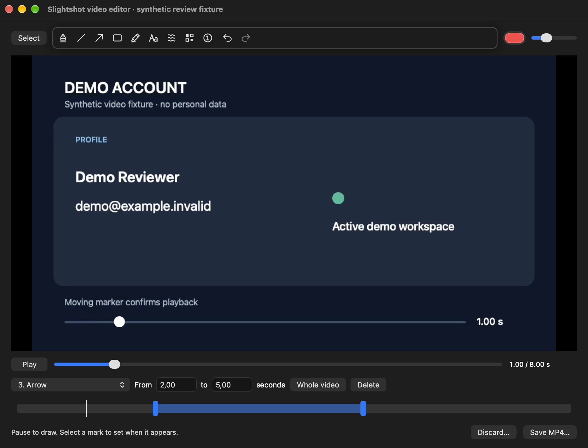
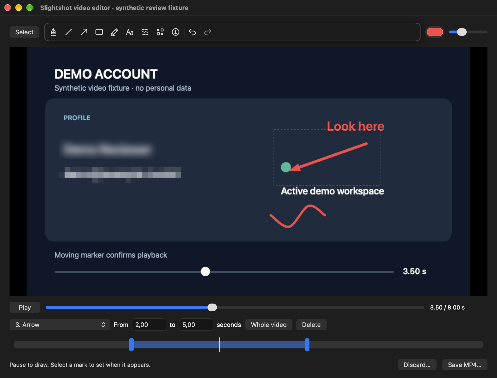
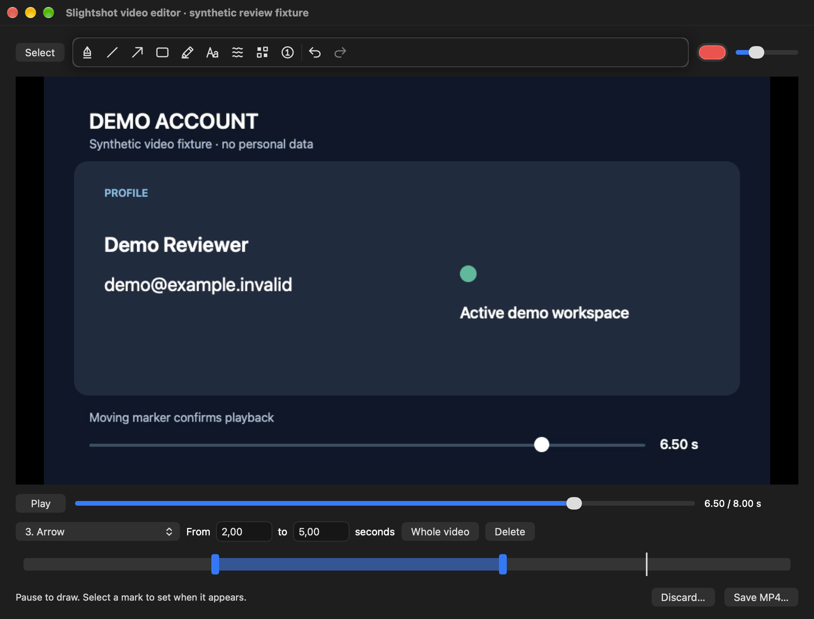
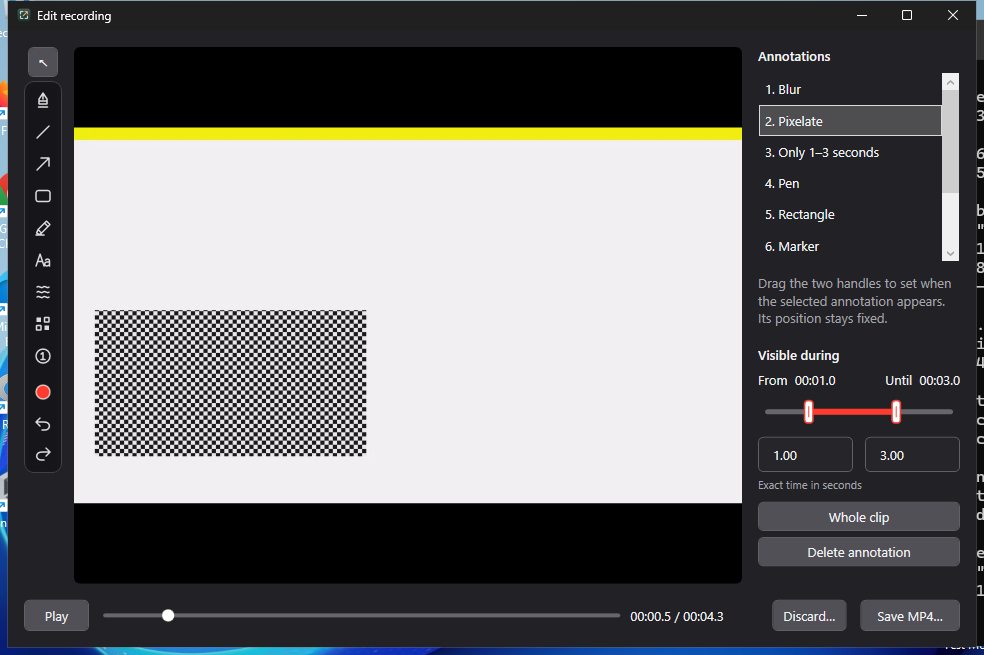
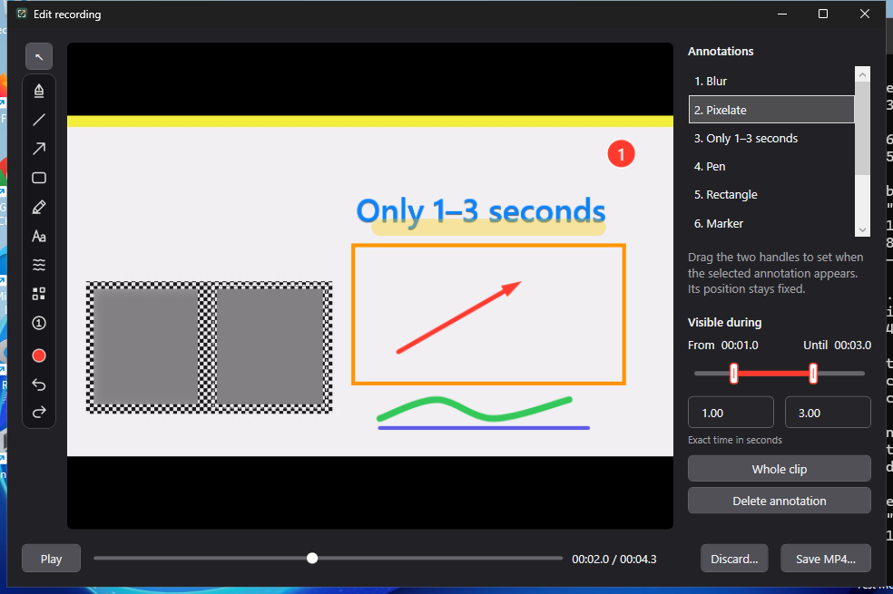
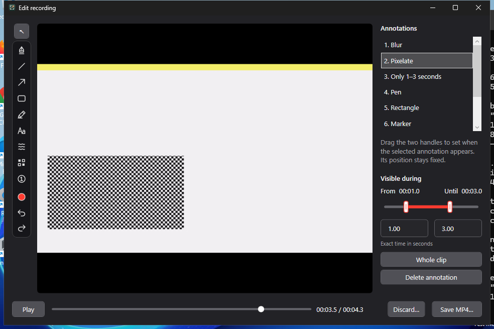

# Timed video annotations

After Stop, the native recording editor opens with the screenshot drawing tools,
Play/Pause and a playhead slider. New marks cover the whole clip. Select a mark
and set its visible interval with two handles or exact start/end times. Undo/Redo
also restore timing and deletion. Marks stay at fixed source coordinates. Save
composites active marks onto each current frame; cancelled or failed exports keep
the source and edits available for retry.

## macOS evidence

Captured from product source `5a6133237d769cc2358fc08e31e19b0197d8018a` on macOS 27,
using the real AppKit `VideoEditorWindow` in an isolated, ad-hoc signed review
bundle. The eight-second 960 × 540 movie and annotation inputs are synthetic.
Automated production annotation commits, range updates, Undo/Redo and seeks
produce the captures. These images use AppKit's native window-frame rendering
because ScreenCaptureKit capture permission was unavailable; they are captures
of the running editor, without generated or illustrated UI.

All five marks cover **2–5 seconds**. Compare the same editor before, during and
after that interval:

| Before: 1 s | During: 3.5 s | After: 6.5 s |
| --- | --- | --- |
|  |  |  |

- [Actual edited MP4](mac/edited-video.mp4), [synthetic source](mac/fixture-source.mp4), [control export](mac/control-video.mp4).
- Decoded MP4 frames [before](mac/export-before.png), [during](mac/export-during.png), [after](mac/export-after.png).
- [Timing/pixel validation and capture provenance](mac/mac-evidence-source.json).

Separate native mouse/keyboard acceptance at source
`a808881fc1d8c067fef1c53277bae6d315ddb4c9` created an arrow, set it
to 2–5 seconds, typed a pending caption and immediately changed its start to 3.
The caption became 3–8 seconds and the arrow remained 2–5 seconds. Dragging the
arrow's start handle to 2.98 and pressing Undo restored 2.00.

## Windows evidence

Captured from product source `2017eed8ba0bbf66bef542cc69c798529f722f71` by the
native WPF smoke fixture on Windows x64 in
[run 38068285277](https://github.com/jmpijll/slightshot/actions/runs/38068285277).
The moving 640 × 360 source is synthetic. A real native pointer drag creates the
arrow; other marks are labelled fixture inputs. Native range handles, exact time
fields, buttons, Undo/Redo and Delete are operated automatically. The screenshots
capture the actual editor HWND from composed desktop pixels.

Marks cover **1–3 seconds**:

| Before: 0.5 s | During: 2 s | After: 3.5 s |
| --- | --- | --- |
|  |  |  |

- [Actual high-quality edited MP4](windows/video-editor-high.mp4).
- [Native UI/export/cancellation/retry validation](windows/video-editor-validation.json).
- [Source commits, acceptance and SHA-256 hashes](provenance.json).

## Validation separate from images

- macOS: warning-free release bundle and signature verification; strict SwiftLint;
  54 Swift tests in 15 suites. Tests include interval boundaries, all drawing tools,
  ordered raster/vector composition, real MP4s at all three qualities, current-frame
  privacy effects and cancellation after media data has been produced. Cancellation
  retains an existing destination and source and removes staging files.
- Windows: 207 portable core checks; warning-free app build; native editor and
  extracted portable x64 editor smoke checks, including pointer/source-coordinate
  mapping, source orientation, before/during/after decoded MP4 pixels at all three
  qualities, early compositor shutdown, active cancellation, failed export/retry
  and temporary-source cleanup.
- Shared: 20 original UI icons verified and 14 Python packaging tests passed.
- Documentation: [GitHub-rendered recording instructions](documentation/readme-video-editor.png),
  captured from README source `ba7198326b5781fa5a7182f178f84cda785d53d0`.

This scope has fixed-position marks and a single selected interval, without motion
tracking, keyframes, cutting or audio. Raster strength uses the existing screenshot
renderer in source pixels. Large/4K preview and export performance has not been
benchmarked; the native fixtures establish correctness at the sizes listed above.

## Reproduce

On Mac, build `SIGN_IDENTITY=- ./Scripts/bundle.sh`, then launch:

```sh
open -n --env SLIGHTSHOT_REVIEW_SOURCE_COMMIT=<source-commit> build/Slightshot.app --args \
  --video-editor-review <output-directory> --video-editor-evidence
```

The bounded fixture runs without registering hotkeys, reading user recordings or
starting normal update/inbox flows. Omit `--video-editor-evidence` for manual native
interaction. If another Slightshot instance is running, use an isolated copy of the
review bundle with its own bundle identifier.

On Windows, run:

```powershell
$env:SLIGHTSHOT_SOURCE_COMMIT = git rev-parse HEAD
Slightshot.exe --video-editor-smoke-test <output-directory>
```

The Windows workflow publishes `windows-native-video-editor-evidence`. The files
in this directory are durable review copies, independent of CI artifact retention.
