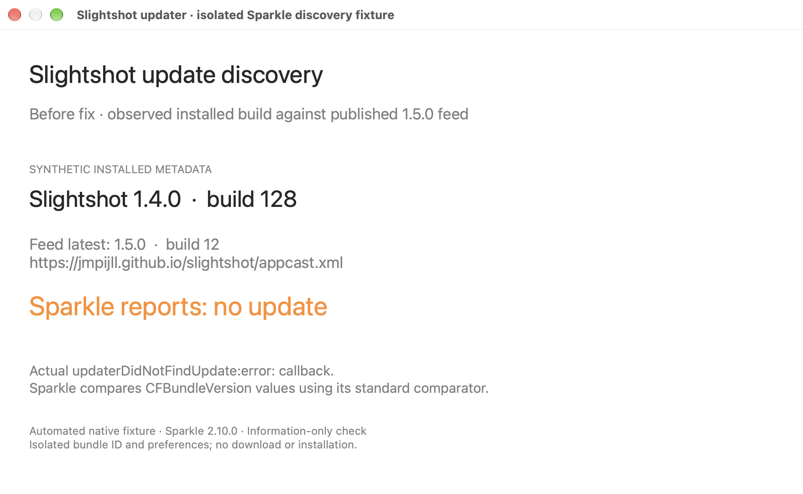
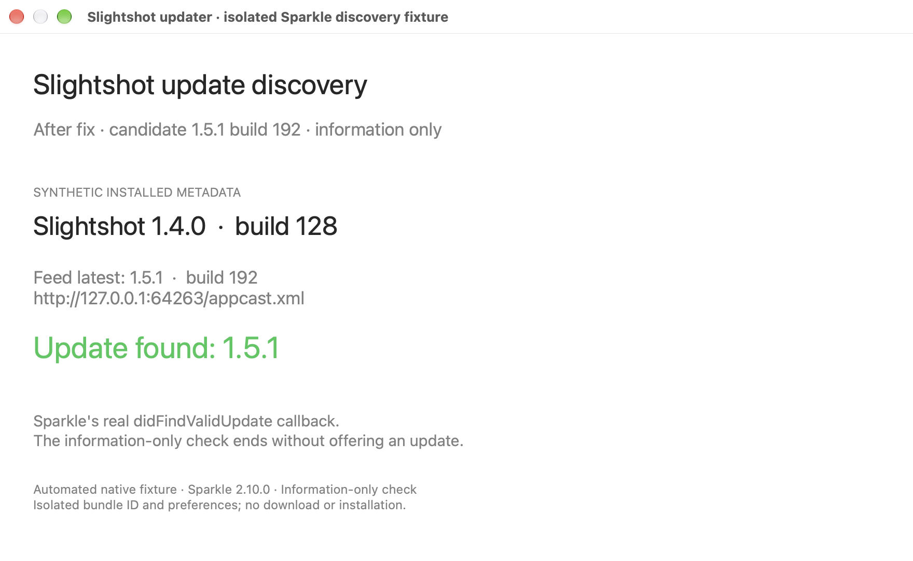
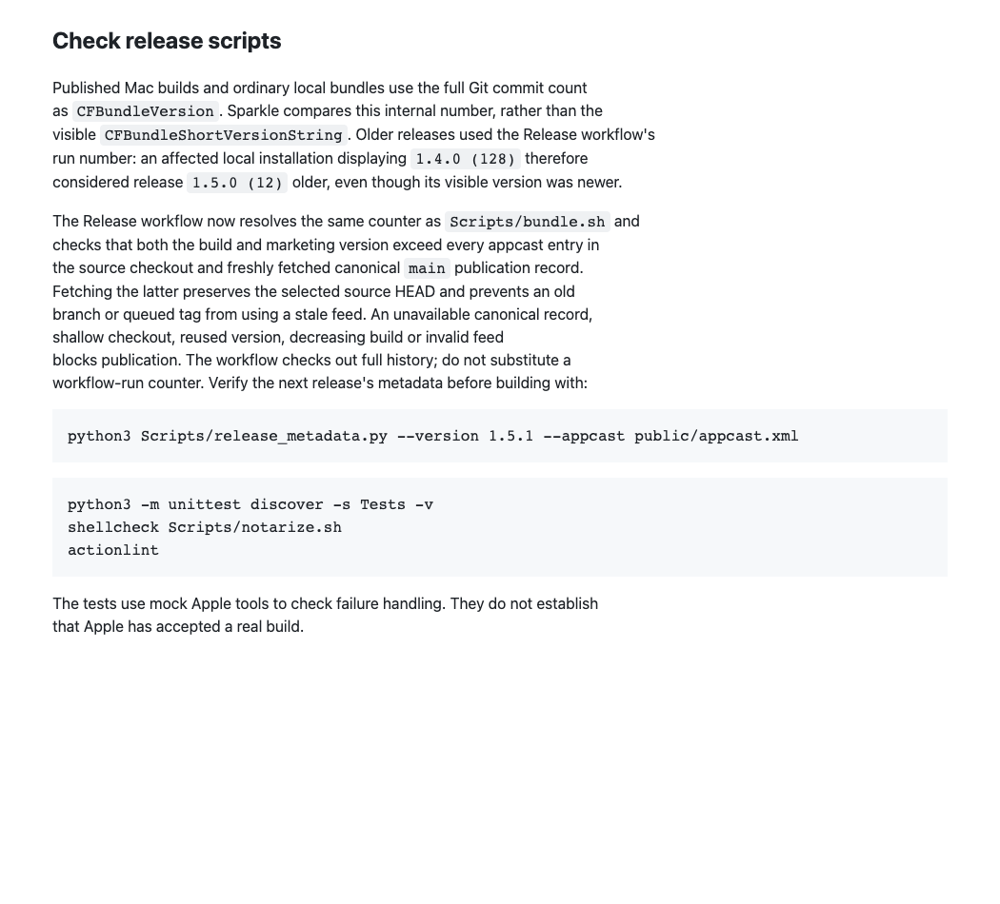

# Updater build-number correction

[Issue #34](https://github.com/jmpijll/slightshot/issues/34) reports macOS 1.4.0 saying it is up to date while 1.5.0 exists. The actual running Settings window showed **1.4.0 (128)**. A real manual updater check named1.5.0 as newest but returned “You’re up to date!”; the dialog was closed without installing or changing settings. The currently rebuilt on-disk bundle is a different observation from the loaded128 metadata.

Sparkle 2.10.0 compares `CFBundleVersion`. Ordinary local bundles used Git commit count, while releases used workflow run count. Build128 sorts after release build 12, regardless of their visible marketing versions. The same real SDK reports no-update reason 2: `SPUNoUpdateFoundReasonOnNewerThanLatestVersion`. The immutable public 1.4.0 download is build9 and does find 12. [Published artifact audit](artifact-audit/published-update-metadata.json) records matching feed/key/framework/minimumOS and verifies the1.5.0 DMG signature using the key embedded in public 1.4.0.

The release workflow now uses the same full-history Git counter as `Scripts/bundle.sh`. It rejects build or marketing-version regression against both the checkout appcast and the freshly fetched canonical main appcast. A stale branch, shallow checkout, unavailable canonical record, reused version or invalid feed stops publication. The fetched publication record does not change source HEAD. Sparkle's standard comparator and trust checks remain in use.

## Actual native SDK evidence

**macOS 27 / AppKit / Sparkle 2.10.0.** These are real ScreenCaptureKit captures of a running native diagnostic fixture, displaying actual `SPUUpdater.checkForUpdateInformation` callbacks. Synthetic installed metadata is labelled in the windows; this is an ad-hoc fixture, not an unmodified Slightshot release binary. Each case has an isolated bundle ID/preferences, disabled automatic behavior and no update offering, DMG download or installation. [Harness source and reproduction](fixtures/README.md) and [process/preference targeting scope](process-and-preference-scope-audit.json) are retained.

Before configuration source: `06cf15b185d1d599201d944453a1f02568f23f1b`, live 1.5.0/build12 feed. After release-policy source: `1806a9eb8280cce7601f1807374d79d30ed4da72`, candidate 1.5.1/build 192 computed by the committed resolver. The native fixture source hash, executable hash, feed snapshots, capture hashes and configuration-source labels are in each provenance record. The final tag will compute its own later commit count.

| Before: observed1.4.0/build 128 metadata | After: same installed metadata, corrected candidate build |
| --- | --- |
|  |  |

| Installed synthetic metadata | Published1.5.0/build12 | Candidate 1.5.1/build 192 |
| --- | --- | --- |
| 1.4.0 /128, matching observed runtime | No update, reason 2 | Finds1.5.1 |
| 1.4.x local-review counter 162, synthetic1.4.0 label | No update, reason 2 | Finds1.5.1 |
| Public1.4.0 counter 9 | Finds1.5.0 | Finds1.5.1 |

[Before matrix](before-matrix.json) · [Candidate matrix](after-candidate192/candidate-provenance.json) · [Candidate build/policy provenance](candidate-provenance.json). The candidate XML is a synthetic prepublication discovery input with a future enclosure. This proves version selection; it does not claim that enclosure exists, is signed or can be installed. Signed public payload/feed validation is separate and must follow publication.

## Checks separate from captures

- The original actual Sparkle comparator loop rejected128/162 versus 12. The native SDK reproduces the complete information-check path and its documented newer-than-latest reason. The same standard comparator and native SDK accept the corrected 192 build.
- All 24 Python checks pass, including 10 new release-metadata checks. The actual Release Resolve version shell step is executed against real Git histories; the old workflow failed the counter regression test before the fix. Coverage includes the small CI counter, every feed item, reused/decreasing version/build, shallow history, malformed feed and an old checkout against a newer canonical origin. The latter fails without changing HEAD.
- `actionlint` and `git diff --check` pass. Full Mac/Linux and Windows PR CI will be recorded in the PR before merge.
- Windows has no automatic availability comparator. Source-linked public 1.4.0/current1.5.0 `AppInfo` probes preserve their displayed version and `/releases/latest` URL; the real URL resolves to 1.5.0 at capture time. A stale-route negative control is rejected. [Windows route report](windows/update-route-validation.json). Windows installer comparisons use marketing versions and are independent of Sparkle build counters. No Windows updater behavior changes.

## Rendered release guide

Actual committed guide excerpt, source 1806a9e, rendered with GitHub Markdown and captured in a browser. [Source/image hashes](documentation-capture-source.json).

