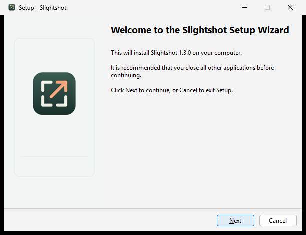
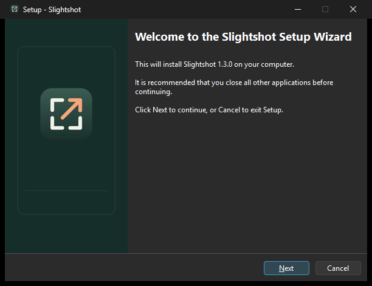

# Windows installer review

These are actual welcome pages rendered by the compiled x64 setup package on
an isolated Windows runner, using the system light and dark settings. They are
not mockups and contain no private desktop content.

| Light | Dark |
| --- | --- |
|  |  |

[Windows run 37761879698](https://github.com/jmpijll/slightshot/actions/runs/37761879698)
passed on source commit `cbe400e7be16afccade756296dd0659fe68550ab`.
The [validation report](installer-validation.json) records 51 lifecycle checks:
clean per-user install, actual `0.0.0` to `1.3.0` payload upgrade, same-version
repair, downgrade refusal, protection of a running app, shortcuts, startup
ownership, settings/capture preservation and uninstall. The installed x64 app
also passed its native screenshot and recording smoke tests from a path
containing spaces. No live desktop capture or recording session was started.

The installer checks ran against the actual package, not a mocked installer.
Their complete setup/uninstall logs and installed renderer/media fixtures are
in the run's `windows-installer-evidence` artifact. The downloaded x64 and ARM64
setup packages matched the SHA-256 values recorded during compilation.
Both packages use an x86 setup bootstrapper with a native x64 or ARM64 payload;
ARM64 installation and app execution have not been tested on ARM64 hardware.

[Mac/Linux run 37761879591](https://github.com/jmpijll/slightshot/actions/runs/37761879591)
also passed 39 Swift tests, 111 Windows core checks, 14 Python tests, strict lint,
build and Mac review-DMG checks. These are PR review artifacts: Windows packages
remain unsigned previews, and the public 1.3.0 release still contains ZIPs only.
