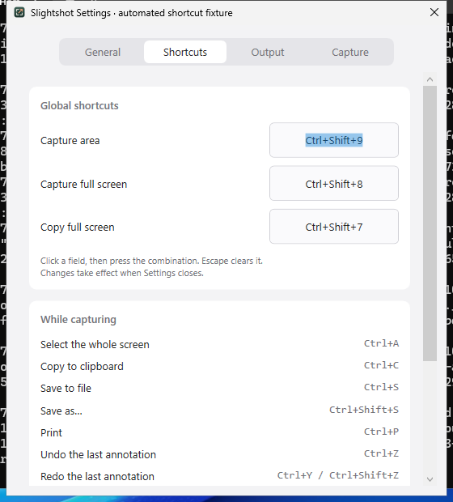
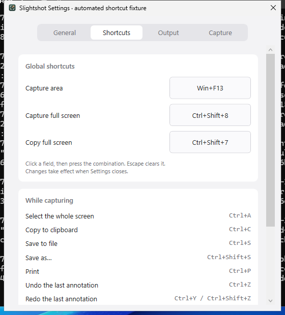

# Windows-key shortcut review

These are real WPF Settings windows on the isolated Windows Server 2025 CI
desktop. The automated native fixture opens Shortcuts, focuses Capture area and
sends Left Win+F13. Captures are composed desktop pixels cropped to the Settings
window. Fixture settings are created in memory; personal settings are not read
or saved.

The baseline capture uses source `3f0cccd655ab1e6bebdcb771260df5a699ac964a`.
The field stays at Ctrl+Shift+9 and the regression assertion fails, confirming
the report. The fixed capture uses source
`8ea2f650467e658183035e841bbb5c628c8fa219`; the same input displays Win+F13.
Workflow URLs, capture inputs and file hashes are in [capture-source.json](capture-source.json).

The baseline and fixed observations are preserved separately. The full native
fixture additionally checks the right Windows key, combinations with other
modifiers, modifier-only input, duplicate assignment, Escape, settings JSON
roundtrip and production global hotkey callbacks after Settings closes. CI
also runs the fixture against the extracted portable x64 executable.
