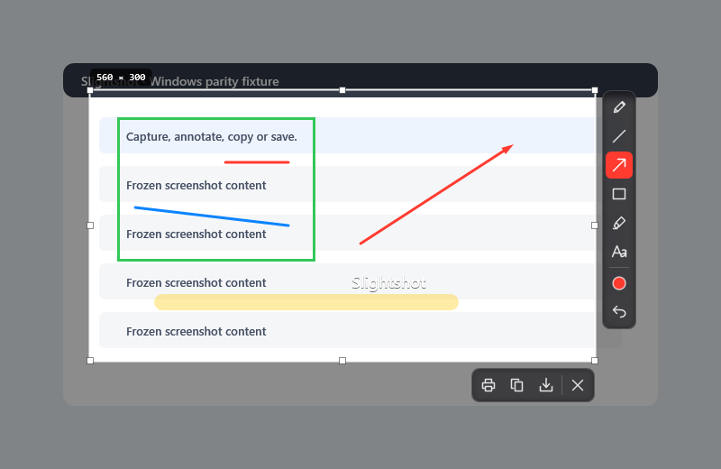
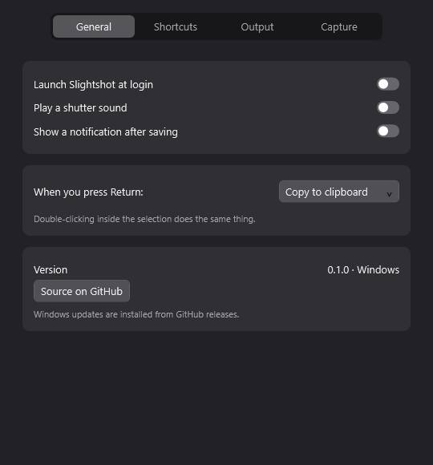
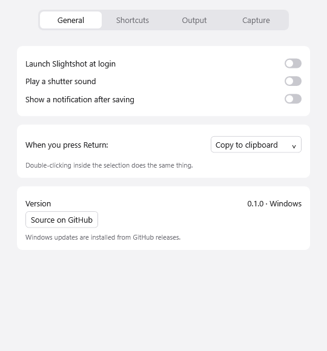

# Native Windows review evidence

These images were rendered by the actual Windows WPF app's synthetic CI fixture.
They show the native overlay and light/dark settings controls; they are **not an
interactive desktop capture or a recording of someone using the app**.

[Windows workflow run 37620923947](https://github.com/jmpijll/slightshot/actions/runs/37620923947)
passed on `016afb3`: warning-free native build, 26 geometry/style/naming checks,
native WPF rendering, and portable x64/ARM64 publication. Export checks passed at
100%, 125%, 150% and 200% DPI: native/logical dimensions, annotation pixels, and
PNG/JPEG/TIFF encoding and decoding. See [validation.json](validation.json).

The saved fixture files came from the
[earlier Windows CI run on the same app code](https://github.com/jmpijll/slightshot/actions/runs/37620721734),
at `496f33c`; `016afb3` only adds the root README link.

Live Windows capture, clipboard/print/tray operation, shortcuts, monitor focus,
mixed-DPI interaction and an actual desktop video still need manual acceptance.
There is no installer, signing or automatic Windows updater in this preview.
