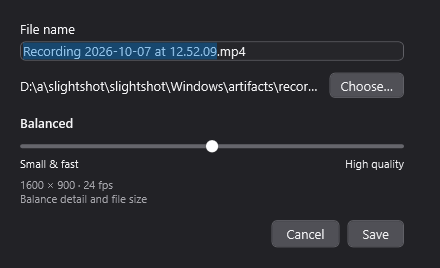
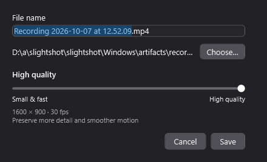
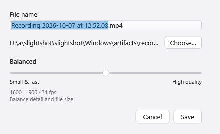

# Windows recording review evidence

Copied from the successful native [Windows CI run 37624042021](https://github.com/jmpijll/slightshot/actions/runs/37624042021),
source revision `bd8301fd9848201e0a3b2afbb9a9fdc54a1f7196`.
The [validation report](recording-validation.json) records the checks performed.

CI creates the real timer/Stop, save and progress windows, verifies that their
native handles accept and retain `WDA_EXCLUDEFROMCAPTURE`, checks timer/Stop and
quality slider behavior, and renders the window content below. The HUD uses an
opaque native window with rounded corners to avoid the Windows 10 conflict
between per-pixel WPF transparency and display affinity.

## Timer and Stop

## Save-time quality

| Small & fast | Balanced | High quality |
| --- | --- | --- |
|  |  |  |

The save dialog follows the Windows app's light/dark preference:

The run's **windows-native-recording-evidence** artifact also contains
`recording-compact.mp4`, `recording-balanced.mp4` and `recording-high.mp4`.
These encode moving synthetic BGRA frames through the real Windows H.264 media
pipeline. CI verifies output dimensions/frame rates, native frame decoding,
Stop finalization, cancellation that preserves an existing destination,
successful retry and temporary-file cleanup.

This is native UI/media evidence. It is **not an interactive Windows desktop
recording or proof that GDI capture excludes the controls under real desktop
composition**. Live desktop capture, mixed-DPI monitor placement and cursor
capture still need a Windows desktop acceptance run. Encoded file size can vary
with content; the quality dialog makes no fixed bitrate or file-size promise.
